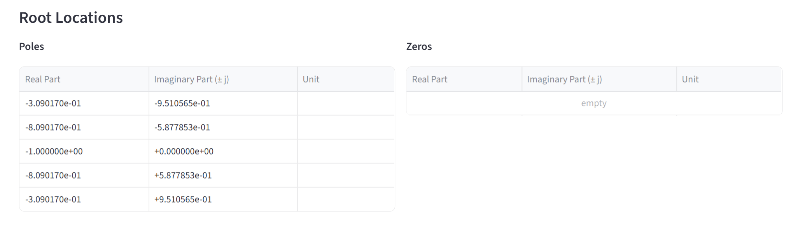
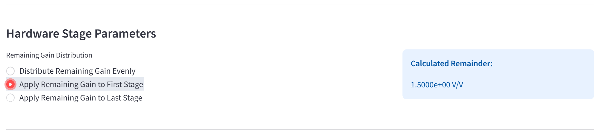
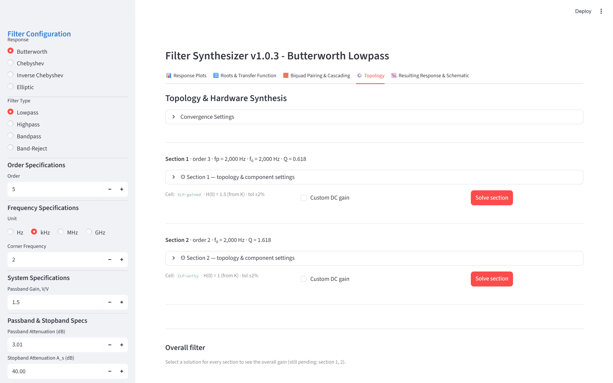
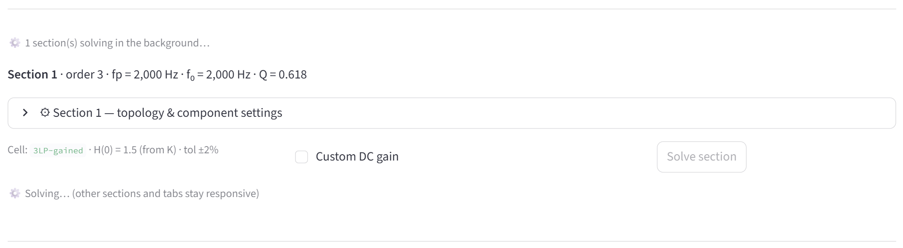
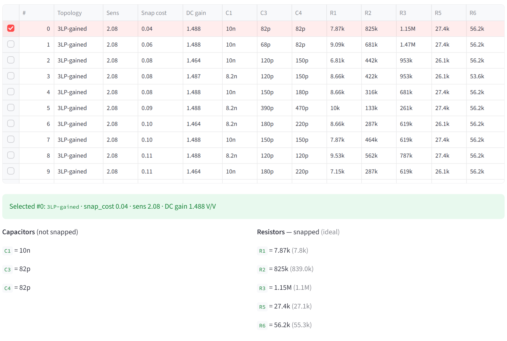
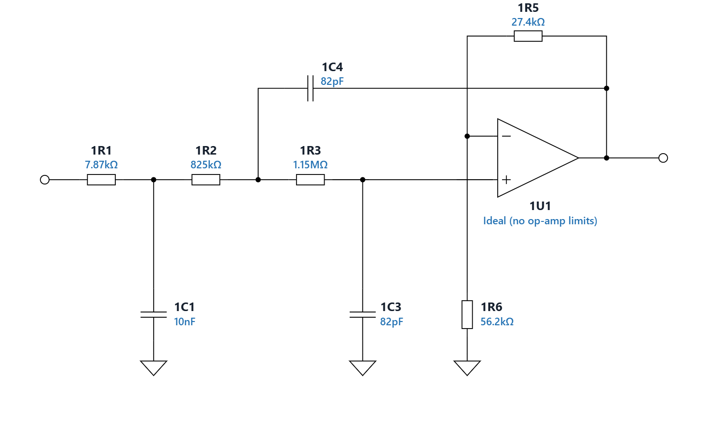
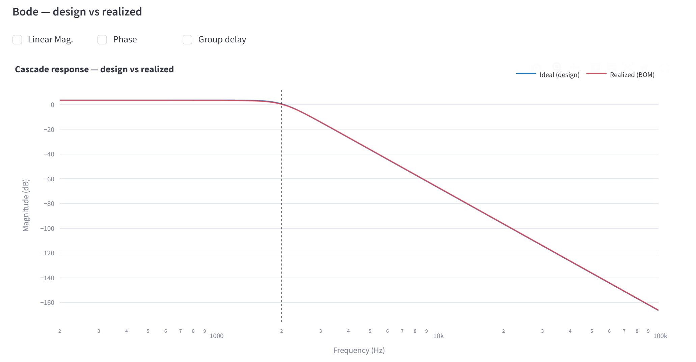
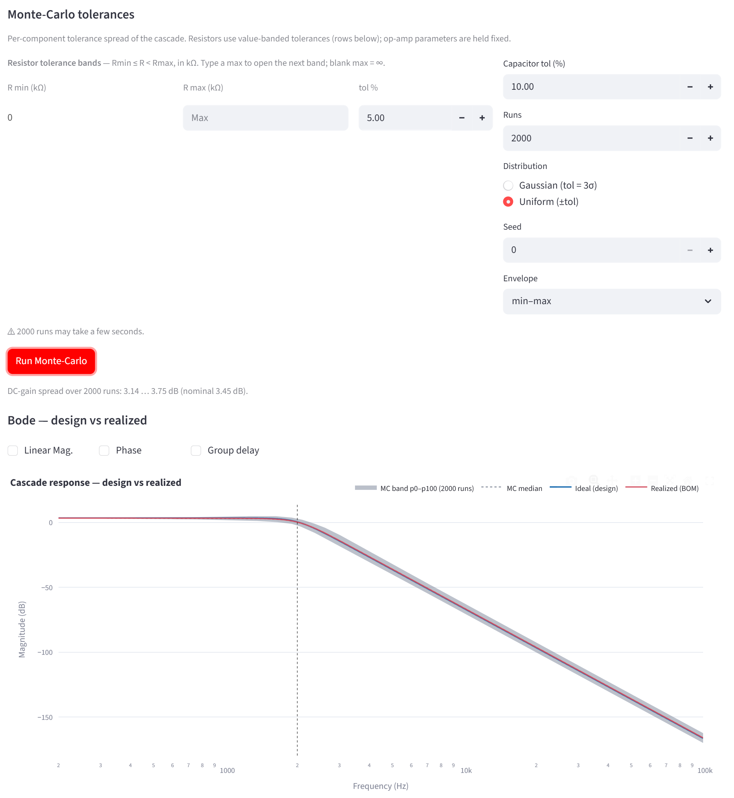

<!-- Maintenance: ONE worked example throughout (SCREENSHOTS.md) — every
     number here comes from that run, so text and figures agree. Narrative
     only: no control keys and no option tables; those live in the User
     Manual. Each chapter ends on something the reader can check against
     its figure. -->

# Before you start

FilterSynthesizer turns an active-filter specification into buildable
sections: component values on standard E-series parts, a schematic for each
section, and a PDF report. It assumes you know your filter approximations; it
takes care of the rest.

**Start it** one of two ways:

- **The packaged app:** double-click `FilterSynthesizer.exe`. A console window
  opens and, 10–20 seconds later on the first launch (2–4 seconds after that),
  your browser shows the app, normally at `http://localhost:8501`. Closing the
  console window quits the app.
- **From source:** `pip install -r requirements.txt`, then
  `python -m streamlit run app.py` in the app folder.

**What you will build.** This guide follows one filter from start to finish —
a 5th-order Butterworth low-pass with a 2 kHz corner and a passband gain of
1.5 V/V — and every number and picture in it comes from that run. At the end
you will have a bill of materials and a schematic for each section, and a PDF
report.

> [!note] The five tabs are a pipeline, not a menu: each works on what the
> previous one produced, so go left to right. Change the specification in the
> first three tabs, where it costs nothing — not after solving hardware.

# 1. Specify the filter

In the sidebar, top to bottom:

- **Response** Butterworth and **Filter Type** Lowpass — both already selected.
- **Order** 5.
- **Unit** kHz — it sits above the frequency box — and **Corner Frequency** 2.
- **Passband Gain, V/V** 1.5.

Leave the other two boxes as they are:

- **Passband Attenuation** 3.01 dB — how far down the response is at the
  corner frequency. 3.01 dB is the classic Butterworth −3 dB corner; a
  different value moves the poles and changes the filter.
- **Stopband Attenuation** 40 dB — for a Butterworth this only sets where the
  app reports the stopband edge. The design does not depend on it.

 

**You should now see** the title *Filter Synthesizer v1.0.3 - Butterworth
Lowpass*, and the plots on the first tab redrawn a moment after each edit.

# 2. Check the approximation before you build it

The **Response Plots** tab shows the filter you specified. The passband sits at
+3.52 dB — that is 1.5 V/V — and the curve crosses the red −α_max line exactly
at the 2 kHz corner. Under the plots, the app reports the calculated stopband
edge for the 40 dB target: 5.0122 kHz.

The **Roots & Transfer Function** tab lists the poles. Normalized to the
corner, a Butterworth's poles lie on the unit circle: here one real pole at −1
and two complex pairs.

This is the moment to iterate. A different order or corner costs nothing now;
after the next chapters, every change means solving the hardware again.

# 3. Split the filter into buildable sections

An active filter is built as a cascade of sections, each realizing a pair of
poles — and five poles do not divide into pairs. On the **Biquad Pairing &
Cascading** tab, tick **Enable 3rd-Order Sections (Absorb 1st-Order Poles)**;
it is off by default. The leftover real pole then joins one of the pairs as a
single 3rd-order section: two sections instead of three, and one op-amp fewer.

Sections are numbered by rising Q. Section 1 is the 3rd-order one, Q = 0.618
plus the real pole; section 2 is 2nd order, Q = 1.618. Both have f₀ = 2 kHz —
a Butterworth's poles all sit at the corner frequency.

Next, the gain. The pairing first sets every section to unity passband gain.
What is still missing to reach the specified gain is the *remaining* gain —
the gain over unity, shown as **Calculated Remainder**. Here the sections give
1 V/V, so the remainder is the whole 1.5 V/V. **Remaining Gain Distribution**
decides which section carries it. Choose **Apply Remaining Gain to First
Stage**: section 1 gets a gain of 1.5, and section 2 stays at unity.

**You should now see** *Calculated Remainder: 1.5000e+00 V/V*, and below it
one table per section.

# 4. Turn section 1 into real components

The **Topology** tab lists the two sections. Each has a header line — order,
real pole fp, f₀ and Q — a settings expander, a gain control and a **Solve
section** button. The caption names the circuit the app will solve: `3LP-gained`
for section 1, a 3rd-order low-pass with gain; `2LP-unity` for section 2.

For this run, change nothing. The settings expander holds the circuit family
(VCVS, i.e. Sallen-Key), the op-amp model (Ideal), the component limits
(68 pF–10 nF, 300 Ω–2 MΩ) and the E-series (E12 capacitors, E48 resistors) —
the User Manual, §3.5, covers each one. **Convergence Settings** at the top of
the tab matters only when a solve comes back empty.

Press **Solve section** in section 1. The solve runs in the background: the
button greys out, a caption says *Solving…*, and the other sections and tabs
stay usable. It takes from a few seconds to about a minute, depending on the
machine.

When it finishes, a table of candidate BOMs appears, best first. They are
ranked by **Sens** — how much the response moves when a component drifts; lower
is better — with ties broken by **Snap cost**, how far the snapped parts leave
the section from its target. **DC gain** is what the snapped parts actually
give. The component columns follow the circuit: C1, C3, C4 and R1–R6 here.

Now the step people miss: **tick the box at the left of row 0.** Solving
produces candidates; only a pick chooses one.

The pick lists the parts and draws the schematic, every part labelled with its
value. Here it is an RC pole (1R1, 1C1) in front of a Sallen-Key stage whose
gain, 1 + R5/R6 = 1 + 27.4k/56.2k = 1.4875, is the 1.488 V/V in the table.

> [!warning] A solved section is not a chosen section. Until every section has
> a picked row, the cascade view and the report stay blocked.

# 5. Do the same for section 2

The same three moves: **Solve section** in section 2, wait, tick **row 0**.
Section 2 is a unity-gain Sallen-Key, `2LP-unity` — two resistors and two
capacitors. In this run: R2 = R3 = 30.1 kΩ, C3 = 820 pF, C4 = 8.2 nF.

At the foot of the tab, **Overall filter** now shows the gain of the whole
cascade: about 1.49 V/V against the 1.5 specified. The 0.8 % difference is
resistor snapping in section 1. A yellow box there would mean the output is
inverted; two non-inverting Sallen-Key sections leave none.

# 6. Check what you actually built

The **Resulting Response & Schematic** tab rebuilds the whole cascade from the
parts you picked. Blue is the design, red is what the snapped parts do, and
wherever the two separate you see the price of E-series values. Here they
overlap: the realized passband is +3.45 dB against +3.52 dB designed.

Then tolerances. **Monte-Carlo tolerances** rebuilds the cascade 2000 times
with every resistor and capacitor varied at random. For this run choose a
pessimistic spread: resistor **tol %** 5, **Capacitor tol (%)** 10,
**Distribution** Uniform (±tol), **Envelope** min–max — then press **Run
Monte-Carlo**. The grey band covers every run, and the caption gives the
DC-gain spread: 3.14 … 3.75 dB. The seed is a control too, so the same inputs
always give the same band.

# 7. Take the design with you

At the foot of the same tab, **Generate Report** builds an A4 PDF: the
specification, the transfer function, the pole–zero map with the section
pairing, a page per section with its schematic and BOM, and the
design-versus-realized Bode plot with the Monte-Carlo band. Everything is
ticked by default. Press **📄 Generate Report**, then **⬇ Download PDF**.

Change anything afterwards and a caption says the PDF is out of date — press
**Generate Report** again. Each schematic can also be saved on its own with
**⬇ SVG**, in the Topology tab and at the foot of this one.

# Where to go next

The User Manual picks up where this guide stops:

- **§3** — every control, tab by tab, with its default.
- **§4** — choosing between VCVS, MFB and AM for a section.
- **§5** — real op-amps, and what they change.
- **§6** — every message the app shows, and what to do about it. Start there
  when a solve comes back empty.
- **§8** — what each page of the report contains.
