<!-- Maintenance: every control's session-state key appears in backticks
     exactly once in this file (§3). docs/manual/tools/doc_drift.py relies on
     that to report what a UI change broke — see DOC_WORKFLOW.md.
     §6 quotes messages verbatim: that is what a stuck reader searches for. -->

# 1. How the app is organized

The sidebar holds the specification. The five tabs turn it into hardware, left
to right. Everything recomputes as you edit; there is no Run button.

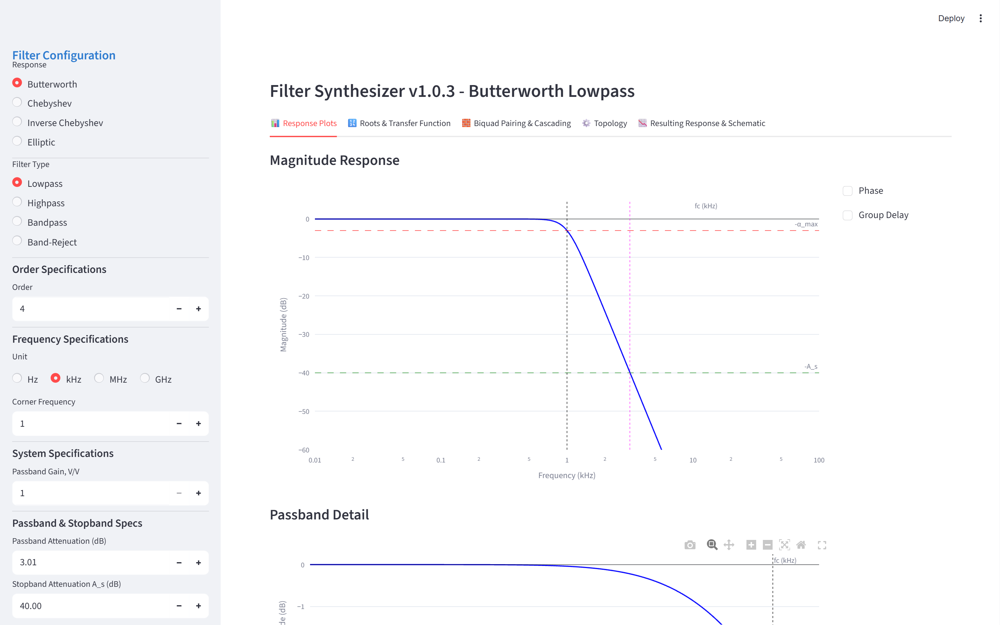

| Tab | What it does | What it needs first |
|---|---|---|
| 📊 Response Plots | Magnitude (optionally phase and group delay) of the approximation; frequency probes; manual notches | A valid specification |
| 🔢 Roots & Transfer Function | Poles, zeros, gain constant K, and H(s) in three forms | — |
| 🧱 Biquad Pairing & Cascading | Groups the roots into sections and shares out the gain; hands the cascade to the Topology tab | Every zero assigned to a section |
| ⚙️ Topology | Per section: circuit family, op-amp, component limits; **solve**, then **pick** one BOM | The cascade from Tab 3 |
| 📉 Resulting Response & Schematic | The cascade built from your picks: Bode plot, Monte-Carlo, schematics, PDF report | A picked BOM in every section |

Tabs 1–3 are mathematics and update at once, so that is where to iterate on
order, corner and gain. Tab 4 is where time is spent: each section is solved on
its own, and solving does not choose anything — you pick a row. Tab 5 and the
report stay blocked until every section has a pick, and say which sections are
still missing.

## What persists and what resets

- **Nothing is saved to disk.** The design lives in the browser session.
  Reloading the page (F5) starts over: the sidebar returns to its defaults and
  every section has to be solved again. The PDF report is the record of a design.
- **The approximation recomputes a moment after each sidebar edit.** A
  specification you have used before comes back instantly from a cache.
- **Solving runs in the background.** Other sections and tabs stay usable
  while a section solves. Solves run one at a time: pressing **Solve section**
  on a second section queues it, and the tab shows how many are running.
- **The Topology tab refreshes itself every two seconds** while it is open —
  that is how finished solves appear without a click.
- **Results are remembered per configuration.** A section's results belong to
  everything that produced them: its f₀, Q and gain, the envelope, the E-series,
  the op-amp and the convergence settings. Change any of these and the table
  disappears and the button reads **Solve section** again; change it back and
  the earlier table returns without a new solve.
- **A pick belongs to the section number.** It survives re-sorting the table
  and switching tabs. After changing the specification, solve and pick every
  section again — until you do, a section keeps its previous pick, and Tab 5 and
  the report use those parts.

# 2. Concepts and vocabulary

| Term | Means |
|---|---|
| Section (stage) | One block of the cascade, realized by one circuit: a complex pole pair (2nd order), a pole pair with an absorbed real pole (3rd order), or a lone real pole (1st order). Zeros assigned to it make it a notch, high-pass or band-pass section. Sections are numbered by rising Q. |
| Absorption | An odd order leaves a real pole. Absorbing it into a pole-pair section makes that section 3rd order and saves an op-amp. Switched on in Tab 3; off by default. |
| f₀, Q, fp, f_z | A section's pole-pair frequency and quality factor; fp is its real pole (absorbed or lone); f_z its notch frequency. Shown in each section's header in Tab 4. |
| Kᵢ | A section's gain constant — the leading coefficient of its transfer function, set by Tab 3's gain distribution. Tab 4 shows the passband gain it implies: H(0) for a low-pass, H(∞) for a high-pass, \|H(f₀)\| for a band-pass. |
| Cell | A named circuit that realizes a section, e.g. `3LP-gained` or `2BP-MFB-QE`. The name encodes order, response and variant (§7.3). |
| BOM (candidate) | One complete set of component values for a section. A solve returns many, ranked. |
| Envelope | The limits a BOM must respect: C_min…C_max, R_min…R_max, Max R ratio, and the E-series. |
| Snapping | Resistors are solved as continuous values, then moved to values of your resistor E-series. Capacitors are taken from their E-series from the start and are never snapped. |
| Sens (sensitivity score) | How strongly the section's transfer-function coefficients move when a component drifts by 1 %. Lower is better. A ranking figure, not a predicted tolerance — Monte-Carlo in Tab 5 is that. |
| Snap cost | How far the snapped parts leave the section from its target: a weighted sum of the fractional errors in gain, pole frequency, Q and notch depth. 0 is perfect, lower is better. Like Sens, it ranks; it is not a percentage. |
| Design vs realized | Design is the mathematical target (blue curves). Realized is what the snapped parts do with the chosen op-amp model (red curves). |
| Sign | Inverting cells contribute −1 to the cascade. An odd number of them inverts the output. |

# 3. Control reference

One table per tab, top to bottom as on screen. The **Key** column is the
control's internal name; quote it when reporting a problem. In keys, `*`
stands for the section number (or a band or notch index). Controls without a
key show "—".

## 3.1 Sidebar — the specification

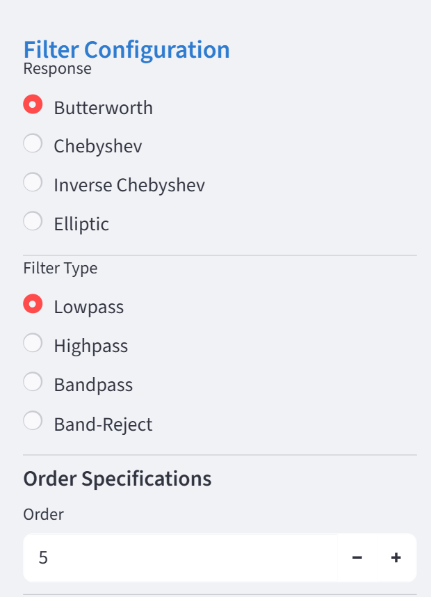 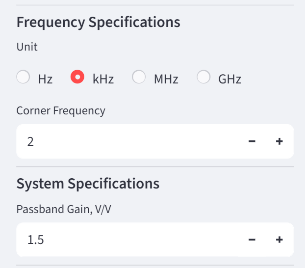

| Control | Key | Default | What it does |
|---|---|---|---|
| Response | — | Butterworth | The approximation: Butterworth (maximally flat), Chebyshev (passband ripple), Inverse Chebyshev (flat passband, notched stopband), Elliptic (ripple in both, steepest). Changes the order limits and which boxes appear below. |
| Filter Type | — | Lowpass | Lowpass, Highpass, Bandpass, Band-Reject. The band types take two corners and an order per side. |
| Order | `widget_sym_order` | 4 | Filter order. For the band types it is the order of each side, labelled **Order (LP & HP)**. Limits below. |
| Asymmetric | `is_asym_checkbox` | off | Band types only (not for a Chebyshev or Elliptic band-reject): separate orders for the two sides. |
| LP Order / HP Order | `widget_lp_order`, `widget_hp_order` | 4 / 4 | Shown when **Asymmetric** is ticked. LP is the upper-edge side, HP the lower-edge side. |
| Unit | — | kHz | Unit of every frequency box and of the Tab 1 probes. |
| Corner Frequency | `widget_fc` | 1 | Lowpass and Highpass: the passband edge. |
| Lower / Upper Passband Corner | `widget_f1`, `widget_f2` | 1 / 2 | Band types: the two passband edges. |
| Passband Gain, V/V | `widget_gain` | 1 | Overall passband gain, at least 1. Tab 3 shares it out among the sections. |
| Passband Attenuation (dB) | — | 3.0103 | Butterworth and Inverse Chebyshev: attenuation at the corner. 0.01–12 dB. |
| Passband Ripple α_max (dB) | — | 1.0 | Chebyshev and Elliptic: the passband ripple, in the same box. |
| Stopband Attenuation A_s (dB) | `sym_as_val` | 40 | Minimum stopband attenuation, 10 dB or more. For Inverse Chebyshev and Elliptic it shapes the design; for Butterworth and Chebyshev it only sets the reported stopband edge f_s and the green line on the plot. The key applies to the Inverse Chebyshev and Elliptic band types; elsewhere the box has none. |
| Lower Stopband A_sl / Upper Stopband A_su (dB) | `as_sl_val`, `as_su_val` | 40 / 40 | Inverse Chebyshev and Elliptic band types with **Asymmetric** ticked: one attenuation per stopband. |
| Response Modifications | — | off | Checkboxes that appear only where they apply — see below. |

### Order limits

| Response | Lowpass / Highpass | Bandpass, per side | Band-Reject, per side | Asymmetric, per side |
|---|---|---|---|---|
| Butterworth | 1–20 | 1–15 | 1–14 | 1–14 |
| Chebyshev | 1–20 | 1–20 | 1–16 | 1–10 (Bandpass only) |
| Inverse Chebyshev | 1–20 | 1–20 | 1–20 | 1–10 |
| Elliptic | 2–15 | 2–15 | 2–15 | 1–10 (Bandpass only) |

A value outside the new limits is clamped when you change the response.

### Coupled behaviour worth knowing

- **The two corners push each other apart.** Raising the lower corner to or
  above the upper one moves the upper corner to twice the lower; lowering the
  upper corner to or below the lower one moves the lower corner to half the
  upper.
- **The corner carries over between filter types.** The Lowpass/Highpass
  corner and the lower band corner are the same stored value.
- **The orders stay in step until you edit HP.** The symmetric order and the
  LP order are one value; the HP order follows it until you change HP once,
  after which it keeps its own.
- **Asymmetric stopbands start equal.** Ticking **Asymmetric** copies the
  common A_s into both A_sl and A_su; unticking copies A_sl back.

### Response Modifications

| Checkbox | Appears for | Effect |
|---|---|---|
| Passband Even Order Modification | Chebyshev and Elliptic, even order, all types except Bandpass | An even-order Chebyshev or Elliptic response normally starts in a ripple valley: the gain at DC (at HF for a high-pass) sits one full ripple below the passband peaks. The modification puts it on a peak instead. |
| Lower / Upper Passband Even Ord Mod | Asymmetric Chebyshev or Elliptic Band-Reject, per even-order side | The same, for each passband separately. |
| Stopband Rolloff | Inverse Chebyshev and Elliptic | Moves one pair of transmission zeros to infinity: one notch fewer, and the stopband keeps falling beyond the last notch. |
| Lower / Upper Stopband Rolloff | Asymmetric Inverse Chebyshev or Elliptic Bandpass | The same, for each stopband separately. |
| Coincident Stopband Notches | Inverse Chebyshev and Elliptic Band-Reject, total order divisible by 4 | The zero pair the rolloff would send to infinity lands at the centre of the stopband instead, so two notches coincide there. |

### Validation

An invalid specification replaces the whole main area with a red
**Mathematical Constraint Violation** box (§6.1). The one you can actually hit:
an asymmetric band-reject needs an even total order (LP + HP). Asymmetric
Elliptic Bandpass also warns, without blocking, when LP + HP exceeds 15.

## 3.2 Tab 1 — Response Plots

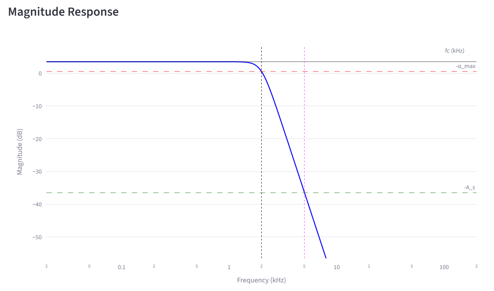

The **Magnitude Response** plot marks −α_max (red dashed), −A_s (green dashed),
the corner (black dashed) and the calculated stopband edge f_s (magenta
dotted). **Passband Detail** below zooms into the passband. Under the plots,
the **Calculated Stopband Edge (f_s)** box is green when the stopband meets
A_s, yellow when a pinned notch pushed the edge out, and red when the stopband
never reaches A_s.

| Control | Key | Default | What it does |
|---|---|---|---|
| Phase | — | off | Adds a **Phase & Group Delay** plot with the phase trace. |
| Group Delay | — | off | Adds the group-delay trace to the same plot. |
| Probe 1 / 2 / 3 | `probe_1_*`, `probe_2_*`, `probe_3_*` | corner, 2× and 10× corner (Lowpass) | Gain and phase of the design at the typed frequency, printed under each box. Each filter type keeps its own probes. |
| Pin *N* | `pin_notch_*` | off | Manual notches, one row per zero pair the order allows. Butterworth and Chebyshev (**Manual Notch Placement**): an unpinned row reads ∞; pinning adds a finite notch at the typed frequency. Inverse Chebyshev and Elliptic (**Manual Notch Tuning**): unpinned rows show the computed notch; pinning freezes it so you can move it. |
| Notch frequency | `val_notch_*` | 2× corner (Lowpass) | The pinned notch's frequency, in the sidebar unit. |
| Lower / Upper Stopband Notches | `pin_notch_hp_*`, `val_notch_hp_*`, `pin_notch_lp_*`, `val_notch_lp_*` | off | Bandpass: the same, one column per stopband. |

Manual tuning is disabled for Elliptic band filters and for Elliptic
Lowpass/Highpass above order 8; the tab says so.

## 3.3 Tab 2 — Roots & Transfer Function

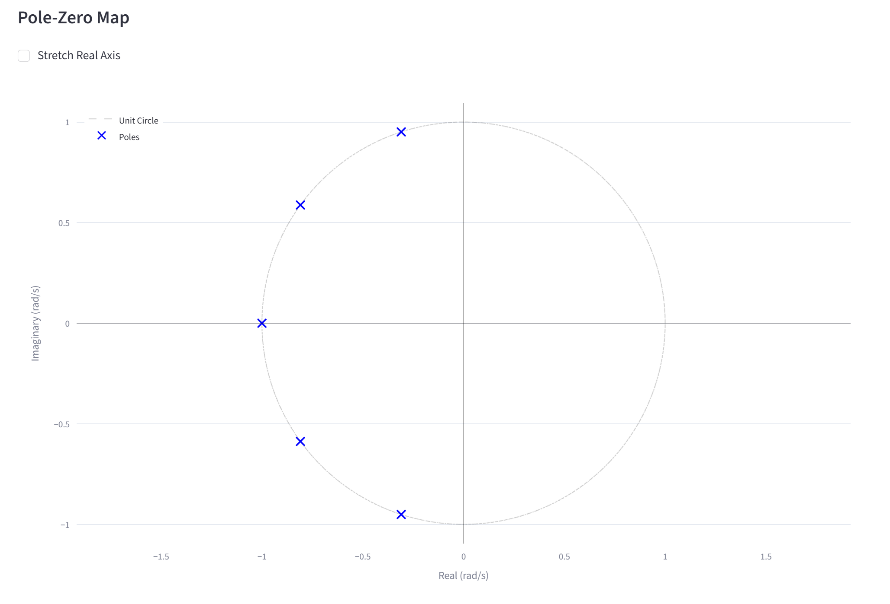

| Control | Key | Default | What it does |
|---|---|---|---|
| Domain Scale | `scale_roots` | Normalized | **Normalized**: corner (band centre for band types) at 1 rad/s, unity gain. **Denormalized**: real frequencies, and K includes the passband gain. |
| Pole-Zero Map Units | `unit_roots` | rad/s | Denormalized only: rad/s or Hertz for the map, the tables and H(s). |
| Stretch Real Axis | — | off | Stretches the map's real axis — useful when poles crowd the imaginary axis. |
| Magnification | — | 1.0 | Shown when stretching: 0.25–10. |

Below the map: **Root Locations** (poles and zeros), the **System Gain
Constant (K)** with its units, and **Transfer Function H(s)** in three
expanders — Expanded Form (Isolated Gain Constant), Expanded Form (Distributed
Gain Constant) and Factored Form (Cascaded Biquads). In each, the rendered
equation wraps to fit the page; the grey box under it is the same expression as
one LaTeX line, ready to copy, followed by the coefficient table.

## 3.4 Tab 3 — Biquad Pairing & Cascading

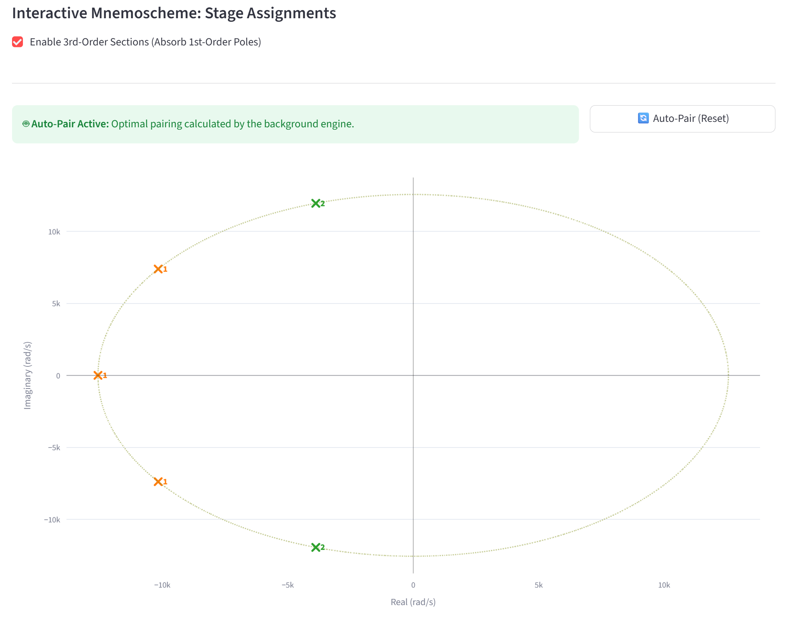

| Control | Key | Default | What it does |
|---|---|---|---|
| Hardware Target Units | `unit_pair` | rad/s | Units of the mnemoscheme and of the section tables below. The Topology tab always works in Hz. |
| Enable 3rd-Order Sections (Absorb 1st-Order Poles) | — | off | Shown only when the filter has a real pole. Ticked: each real pole is absorbed into a pole-pair section, which becomes 3rd order. Unticked: the real pole is a 1st-order section of its own. |
| The mnemoscheme | `pz_mnemo_chart` | automatic pairing | The pole-zero map with each section in its own colour. Clicking edits the pairing (below). |
| 🔄 Auto-Pair (Reset) | — | — | Discards manual edits and restores the automatic pairing. |
| Remaining Gain Distribution | — | Distribute Remaining Gain Evenly | The pairing first sets every section to unity passband gain; the **Calculated Remainder** is the factor still needed to reach the specified passband gain (the gain over unity). This decides where it goes: shared evenly, all to the first stage, or all to the last stage. Band-Reject adds **Equalize DC and HF gains of LP and HP sections**, which makes both passbands land on the specified gain. |

**Editing the pairing by hand.** Click a pole to select it, then click a zero
to move that zero into the pole's section, or a real pole to absorb it (needs
the checkbox), or the same pole again to cancel — or, on an absorbed real pole,
to detach it into its own section. The banner turns to **Manual Override
Active**; sections are renumbered by rising Q after every edit. Until every
zero belongs to a section, the gain distribution and the section tables are
withheld and the cascade is not handed on.

Each section below the map shows its transfer function (rendered and as a
LaTeX line) and a table: Kᵢ, ω₀ or f₀, Q, the notch ωz or fz, the real pole ωp
where there is one, and **Peak Mag (V/V)** — the section's own maximum gain.

## 3.5 Tab 4 — Topology & Hardware Synthesis

Each section has a header line — order, fp for a real pole, f₀, Q, and f_z for
a notch — then its settings expander, its gain control, the cell caption and
the **Solve section** button. The caption names the cell the gain selects, e.g.
*Cell: `3LP-gained` · H(0) = 1.5 (from K) · tol ±2%*: a section gain within
±2 % of 1 uses the unity cell, above it the gained cell, below it an attenuating
cell.

### Convergence Settings

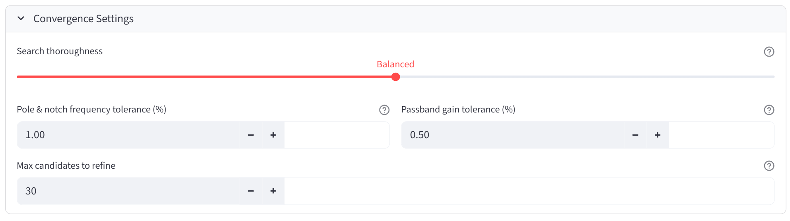

These apply to every section.

| Control | Key | Default | What it does |
|---|---|---|---|
| Search thoroughness | `hw_effort` | Balanced | Fast / Balanced / Thorough: how many starting points the search tries and how many minima it keeps. Thorough finds more candidates and takes longer. |
| Pole & notch frequency tolerance (%) | `hw_pole_tol_pct` | 1.00 | How far a candidate's realized f₀ — and a notch section's f_z — may sit from the target; used by the notch search path. Q is not gated by it. |
| Passband gain tolerance (%) | `hw_gain_tol_pct` | 0.50 | How far a candidate's realized passband gain may sit from the target: DC gain for low-pass and notch cells, HF gain for high-pass. |
| Max candidates to refine | `hw_topk` | 30 | Only the best N ideal solutions, by sensitivity, are corrected for the op-amp and snapped — the expensive step for gained and notch cells. Lower is much faster and lists fewer BOMs. 1–500. |

Leave these alone until a solve returns nothing *and* the envelope is already
wide; then raise **Search thoroughness**. Lower **Max candidates to refine**
when a gained or notch section is slow. Loosening the tolerances admits
candidates that miss the target by more — a last resort.

### Per-section settings

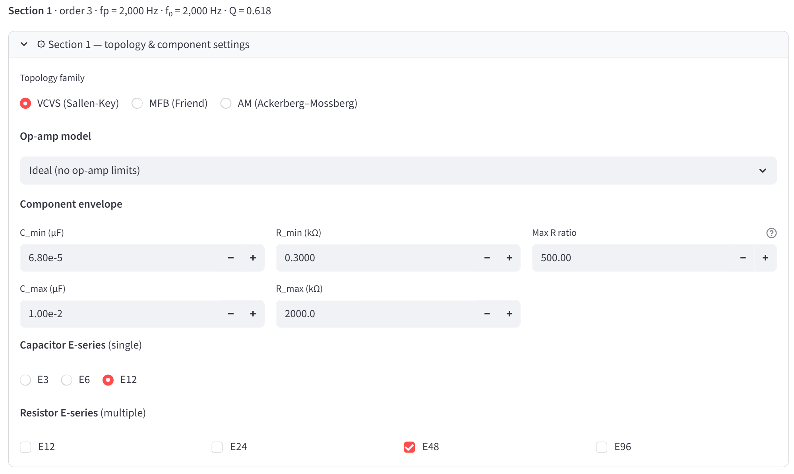

| Control | Key | Default | What it does |
|---|---|---|---|
| Topology family | `hw_fam_*` | VCVS (Sallen-Key) | VCVS (Sallen-Key), MFB (Friend) or AM (Ackerberg–Mossberg). §4 helps choose. |
| Op-amp model | `hw_opamp_choice_*` | Ideal (no op-amp limits) | A library part or **Custom…**. With a real part the solver corrects for it and checks the BOM against its non-ideal model (§5). |
| A_ol (V/V), GBWP (Hz), Ro (Ω) | `hw_aol_*`, `hw_gbwp_*`, `hw_ro_*` | 1e5, 1e6, 1200 | **Custom…** only: open-loop gain, gain-bandwidth product, output resistance. |
| C_min, C_max (µF) | `hw_cmin_*`, `hw_cmax_*` | 6.80e-05, 1.00e-02 | Capacitor window: 68 pF to 10 nF. |
| R_min, R_max (kΩ) | `hw_rmin_*`, `hw_rmax_*` | 0.3000, 2000.0 | Resistor window: 300 Ω to 2 MΩ. |
| Max R ratio | `hw_ratio_*` | 500 | Largest over smallest resistor in one BOM. A wider spread is rejected. An MFB band-pass alone needs about 4·Q², so 500 allows Q up to about 11. |
| Capacitor E-series | `hw_cser_*` | E12 | E3, E6 or E12 — one. Capacitor values come from this series directly. E3 is not usable yet (§6.3). |
| Resistor E-series | `hw_rser_*_*` | E48 | E12, E24, E48, E96 — any combination. Resistors are snapped to the union. With none ticked, E48 is used. |
| Equalize R, C values | `hw_ameq_*` | on | AM only. The handbook balanced design: R5 = R6 = R7 = R8 and C2 = C3. Untick to free R5/R6 and C2/C3 for a closer E-series fit; R7 = R8 stays matched. |
| Gained MFB | `hw_mfbgain_*` | off | MFB, 2nd-order high-pass-notch sections: solve the unity/gained realization instead of the attenuating one. Its HF gain lives in a narrow band, so **Custom HF gain** is switched on and pre-filled with the band's middle. |
| Lower Sensitivity MFB | `hw_mfbls_*` | off | MFB, low-pass-notch sections: solve the low-sensitivity branch (Q set passively, S_Q < 1, a deeper null with a real op-amp). |
| Eliminate R1 | `hw_mfbls_nor1_*` | off | 2nd-order low-pass notch with **Lower Sensitivity MFB** ticked: drop R1 for a 7-part cell. The DC gain is then pinned to a narrow window, so **Custom DC gain** is switched on and pre-filled. |

A 1st-order section has a shorter expander, **⚙ Section N — component
settings**: the op-amp, **C_max** (the pole is realized at the three E-series
capacitor values nearest below it), and the two E-series. It needs no family
and no Solve button: it is solved in closed form as soon as it appears.

### Per-section gain

| Control | Key | Default | What it does |
|---|---|---|---|
| Custom DC gain / HF gain / DC/HF gain | `hw_dc_chk_*` | off | Off: the section uses the gain Tab 3 gave it. On: type your own. The label follows where the passband is — DC for a low-pass, HF for a high-pass, DC/HF for a pure notch (equal at both ends). Greyed and forced on by **Gained MFB** and **Eliminate R1**. |
| (gain value) | `hw_dc_val_*` | the allocated gain | 2nd/3rd order: at least 0.1. Below 1 selects an attenuating cell where the family has one — a 2nd-order low-pass or any high-pass for VCVS; any section for MFB and AM. Moving gain between sections does not rebalance the others; keep the product equal to the passband gain. |
| Override section Ki value | `hw_ki_chk_*` | off | Band-pass sections, in place of the gain control. The passband of a band-pass is its peak, whose height depends on Q, so the coefficient Kᵢ is set directly; the caption shows the pairing Kᵢ and the resulting \|H(f₀)\|. |
| Ki | `hw_ki_val_*` | the pairing Kᵢ | In rad/s, or (rad/s)² for a band-pass with an absorbed low-pass pole. |
| Realization | `hw_fo_real_*` | Non-inverting | 1st-order sections: non-inverting (sign +1) or inverting (−1). Custom gain is then at least 0.01; non-inverting below 1 is an attenuator. |

### Solving and the candidates table

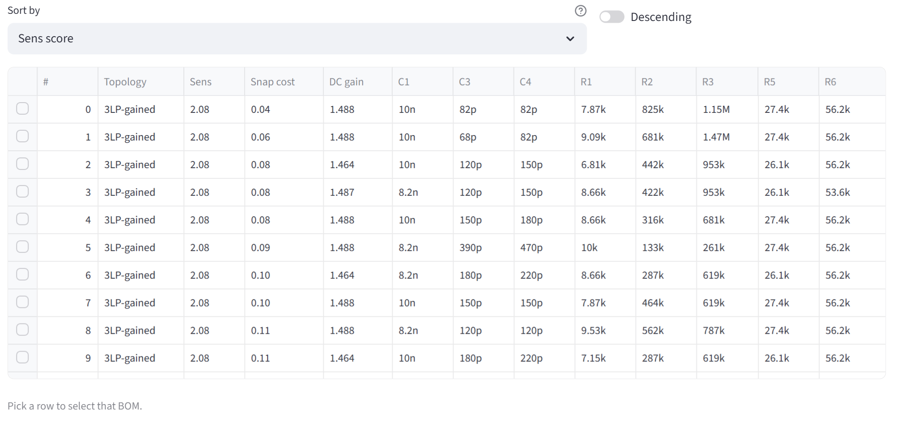

| Control | Key | Default | What it does |
|---|---|---|---|
| Solve section / Re-solve | `hw_solve_*` | — | Starts the solve in the background. Greyed while it runs, and when the chosen family has no cell for this section. Reads **Re-solve** when results for these exact settings exist. |
| Sort by | `hw_sortf_*` | Sens score | Sens score, Snap cost, the gain column, or any component column. Sorts by numeric value, so 8.25k comes before 78.7k. |
| Descending | `hw_sortd_*` | off | Reverses the order. |
| The table | `hw_df_*` | no row | Tick the box at the left of a row to pick that BOM. |
| Select solution # | `hw_pick_*` | 0 | Only on Streamlit versions without row selection: type the row's **#**. |

**Reading a row.** **#** is the row's place after sorting; **Topology** the
cell; **Sens** and **Snap cost** as in §2; the gain column (**DC gain**,
**HF gain**, **DC/HF gain** or **Center gain**) is the passband gain the
snapped parts actually give, op-amp included. Then one column per component
the solved cells use. By default rows are ranked by Sens rounded to two
decimals, with ties broken by the lower snap cost. A capacitor shown as
`1n,2n` is two capacitors in parallel.

**After a pick**, a green box repeats the choice (*Selected #0: `3LP-gained` ·
snap_cost 0.04 · sens 2.08 · DC gain 1.488 V/V*), the BOM is listed —
capacitors as chosen, resistors snapped with the pre-snap ideal value in grey —
and the schematic is drawn with designators prefixed by the section number
(1R1, 1C1 …) and the op-amp's name under U. With a real op-amp, a caption
confirms *BOM checked against exact non-ideal op-amp physics.*

| Control | Key | What it does |
|---|---|---|
| ⬇ SVG | `*_svg_*` | The annotated schematic as a vector file. Here and in Tab 5. |
| ⬇ PNG | `*_png_*` | The same as a bitmap. Only present when PNG export works (§6.8). |

### Overall filter

At the foot of the tab, once every section has a pick: **Overall realized DC
gain** (HF gain for a high-pass) — the product of the sections' realized gains,
signed — and **Overall realized passband gain**, which scales that by the
design's passband-to-DC ratio. A band-pass shows only the centre gain; a
band-reject shows **LF passband gain** and **HF passband gain** separately. A
yellow box warns when the output is inverted (§6.5).

## 3.6 Tab 5 — Resulting Response & Schematic

**Monte-Carlo tolerances** perturbs every resistor and capacitor of the picked
BOMs; op-amp parameters stay fixed.

| Control | Key | Default | What it does |
|---|---|---|---|
| R max (kΩ) | `rtol_max_*` | blank = ∞ | Resistor tolerance bands, Rmin ≤ R < Rmax. Typing a maximum opens the next band, which starts there. |
| tol % | `rtol_tol_*` | 1.00 | Tolerance of the resistors in that band. |
| ✕ remove last band | `rtol_rm` | — | Removes the last band. |
| Capacitor tol (%) | `resp_ctol` | 5.00 | Tolerance of every capacitor. |
| Runs | `resp_runs` | 2000 | 10–20000. Above 1000 a caption warns it may take a few seconds. |
| Distribution | `resp_dist` | Gaussian (tol = 3σ) | Gaussian: the tolerance is three standard deviations. Uniform: equally likely anywhere within ±tol. |
| Seed | `resp_seed` | 0 | The same seed and inputs give the same band — reruns are reproducible. |
| Envelope | `resp_envelope` | p1–p99 | Which percentiles the shaded band spans: p1–p99, p5–p95 or min–max. |
| Run Monte-Carlo | `resp_mc_run` | — | Runs it and draws the band; a caption gives the DC-gain spread. |
| Linear Mag. | `resp_show_linear` | off | Linear magnitude axis. |
| Phase | `resp_show_phase` | off | Adds the phase. |
| Group delay | `resp_show_gd` | off | Adds the group delay, design and realized. |

The plot, **Cascade response — design vs realized**, draws Ideal (design) in
blue, Realized (BOM) in red, the Monte-Carlo band in grey with its median
dashed, and a vertical line at each section's f₀ (and f_z). Below it, every
section's schematic is stacked in cascade order with its own download buttons.

### Report options

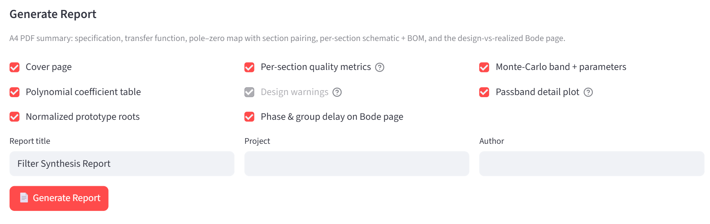

| Control | Key | Default | What it does |
|---|---|---|---|
| Cover page | `rep2_cover` | on | A title page. The three boxes below appear only while it is ticked; unticked, the report uses the default title. |
| Report title | `rep2_title` | Filter Synthesis Report | Heading of page 1 and every footer. |
| Project | `rep2_project` | blank | Big title on the cover (blank: *Active Filter Design*). |
| Author | `rep2_author` | blank | On the cover. |
| Polynomial coefficient table | `rep2_coeff` | on | Report §2a/2b. |
| Normalized prototype roots | `rep2_norm` | on | Report §4a. |
| Per-section quality metrics | `rep2_metrics` | on | Sensitivity, snap cost, realized against target gain, per section. |
| Design warnings | `rep2_warn` | on | Carries the HF-resonance notes (§5) into the report. Greyed when none were raised. |
| Phase & group delay on Bode page | `rep2_phgd` | on | Adds them to report §6. |
| Monte-Carlo band + parameters | `rep2_mc` | on | The band, its settings and the passband-gain spread. If Monte-Carlo has not run with the current inputs, generating runs it once. |
| Passband detail plot | `rep2_zoom` | on | Report §7: the band of interest only. **Stopband detail** for a band-reject. |
| 📄 Generate Report | `report_btn` | — | Builds the PDF. Greyed variants: `report_btn_blocked` (a section has no pick), `report_btn_nodata` and `report_btn_nobackend` (§6.5). |
| ⬇ Download PDF | `report_dl` | — | Saves *FilterReport_&lt;response&gt;_&lt;type&gt;_n&lt;order&gt;_&lt;date&gt;_&lt;time&gt;.pdf*. |

# 4. Choosing a topology family

Each section chooses its own family, so one cascade can mix them.

| | VCVS (Sallen-Key) | MFB (Friend) | AM (Ackerberg–Mossberg) |
|---|---|---|---|
| Op-amps per section | 1 | 1 | 3 |
| Polarity | Non-inverting; the pure notch inverts | Inverting; the notch cells do not | Inverting |
| Low-pass, high-pass, with or without notch | Yes | Yes | Yes |
| 2nd-order band-pass, pure notch | Yes | Yes | Yes |
| 3rd-order band-pass (absorbed real pole) | No | Yes | No |
| Section gain below 1 | 2nd-order low-pass; any high-pass | Any section | Any section |
| Strength | Fewest parts | Covers every section kind; gain is a free ratio | Q barely moves with op-amp bandwidth |
| Cost | Q sensitivity grows with Q | Inverts; Q-enhanced twins trade sensitivity for spread | Three op-amps; needs a low-output-resistance op-amp |

**MFB** solves each cell together with its Q-enhanced (`-QE`) positive-feedback
twin and ranks them; the plain cell usually wins where Q is modest. **AM** gets
its accuracy from the matched pair R7 = R8, which compensates the op-amp's
finite bandwidth: its Q error grows with (f₀/f_t)² instead of Q·f₀/f_t.

Rules of thumb:

- **Start with VCVS.** It is the cheapest realization of low-pass and
  high-pass sections.
- **A 3rd-order band-pass section needs MFB** — or untick absorption in Tab 3
  so the real pole becomes its own 1st-order section.
- **A section gain below 1** on a 3rd-order low-pass needs MFB or AM, or move
  that gain to another section in Tab 3.
- **A real op-amp drags the realized curve away near a high-Q f₀:** try AM
  with a low-Rₒ op-amp.
- **Polarity matters:** count the inverting sections; the Overall filter
  readout warns when the total is odd.
- **No BOM at all:** before changing family, read the diagnosis (§6.4) — it
  often says the family is fine and the envelope is not.

# 5. Op-amps and what they do to the design

The op-amp is chosen per section, because a high-Q or high-gain section
demands more bandwidth than the others.

| Library entry | A_ol (V/V) | GBWP | Rₒ |
|---|---|---|---|
| Ideal (no op-amp limits) | ∞ | ∞ | 0 |
| AD8505 / AD8506 / AD8508 | 1·10⁵ | 95 kHz | 1 kΩ |
| LMV358A | 1·10⁵ | 1 MHz | 1.2 kΩ |
| MAX9636/MAX9637/ MAX9638 | 1·10⁵ | 1.5 MHz | 100 Ω |
| MAX40100 | 1.41·10⁶ | 1.5 MHz | 100 Ω |
| Custom… | your values | your values | your values |

- **A_ol** — finite DC gain: small gain and Q errors.
- **GBWP** — the op-amp's gain falls with frequency. This shifts f₀ and
  raises Q, more so for high-Q, high-gain sections and as f₀ approaches the
  GBWP.
- **Rₒ** — output resistance works against the feedback network and shows up
  far above the passband, as a rise of the realized response.

With a real op-amp the solver pre-distorts the ideal solution so that the
section lands on target *with* that op-amp, then snaps and checks the BOM
against the exact non-ideal model. Tab 5's realized curve and the report use
the same model; Monte-Carlo holds it fixed. The part number (or the Custom
parameters) is printed under the op-amp in the schematic.

**The HF resonance warning.** Tab 5 compares realized with design from the
highest corner up to 100 times it. When red rises at least 1 dB above blue, a
yellow box appears:

> [!warning] ⚠ HF resonance (~N dB at F) — over [range] the realized (red)
> response peaks ~N dB above the design (blue). This is the
> Ackerberg–Mossberg finite-Rₒ loop resonance from the op-amp output impedance
> (AM section …), not a synthesis error.

Without AM sections it reads **⚠ HF rise** and blames the output impedance
alone. It is physics, not a solver fault. Fix it with an op-amp of lower
output resistance (about 50 Ω or less), or with MFB for the sections it names.

# 6. When it goes wrong

Messages are quoted as the app prints them; "…" marks the parts that vary.

## 6.1 Specification and approximation

| The app says | What it means | What to do |
|---|---|---|
| Mathematical Constraint Violation: Band-Reject filters require an EVEN total order. Your current total is N. | Asymmetric band-reject with LP + HP odd. | Change one of the two orders by one. |
| Mathematical Constraint Violation: Asymmetric Elliptic Band-Reject requires … | Asymmetric elliptic band-reject needs even orders that differ by at most 2. | Adjust the orders. |
| ⚠️ Max total order for Asymmetric Elliptic is 15. Extreme orders may cause calculation delays. | A warning, not a block. | Lower LP + HP, or be patient. |
| Engine Error: … | The approximation engine failed for this specification. | Change the specification slightly (order, corners, A_s). If it persists, report it (§6.7). |
| Stopband Attenuation does not meet the requirements (Asymptote exceeds limit) | The stopband never reaches A_s — typically after pinning notches. | Unpin or move notches, raise the order, or lower A_s. |
| Calculated Stopband Edge (f_s): … (Extended due to manual notch placement) | A pinned notch pushed the stopband edge out. | Informational. Move the notch if f_s matters. |
| Order is too low to support finite transmission zeros. | No notch rows at this order. | — |
| Manual Notch Tuning … is disabled … | Elliptic band filters, and Elliptic above order 8. | By design. |

## 6.2 Pairing

| The app says | What it means | What to do |
|---|---|---|
| ⚠️ Pairing Incomplete: There are floating zeros on the board (drawn in gray). Please assign them to a stage. | A manual edit left zeros without a section; nothing is handed to the Topology tab. | Click a pole, then the grey zero — or press 🔄 Auto-Pair (Reset). |
| ⚠️ Please click a Pole first to initiate routing. | A zero was clicked first. | Click a pole, then the zero. |
| 🚫 Cannot merge poles: 'Enable 3rd-Order Sections' is unchecked. | Absorbing a real pole needs the checkbox. | Tick it. |
| ⚠️ Manual Override Active: Background auto-router is currently bypassed. | Your edits are in charge. | 🔄 Auto-Pair (Reset) to go back. |

## 6.3 Topology, before and during a solve

| The app says | What it means | What to do |
|---|---|---|
| Finalize the cascade in Biquad Pairing & Cascading first — each section will appear here for hardware synthesis. | No cascade yet. | Complete the pairing in Tab 3 (§6.2), or fix the specification. |
| ⏳ … section (family …) — solver not yet available; gated to avoid mis-solving on a mismatched cell. | No solver exists for this kind of section yet. | Re-pair so the section becomes a supported kind — e.g. untick absorption. |
| Section N is a 3rd-order band-pass … Switch this section to MFB (Friend) … | VCVS and AM cannot place the third pole of a band-pass. Solve is greyed. | Family → MFB, or give the real pole its own section. |
| No R series selected — defaulting to E48. | No resistor series ticked. | Tick at least one. |
| ⚠ E3 must be added to `unified_solver_v2._E_SERIES`, else the cap grid is empty. | E3 capacitors are not enabled in the solver yet. | Use E6 or E12. |
| ⚙️ Solving… (other sections and tabs stay responsive) | Normal. | Keep working elsewhere. |

## 6.4 A solve that returns nothing

When a solve finds no BOM, the app runs a quick idealized check of what the
section would need and replaces the generic message with a diagnosis. The
diagnosis can take up to half a minute after the solve ends.

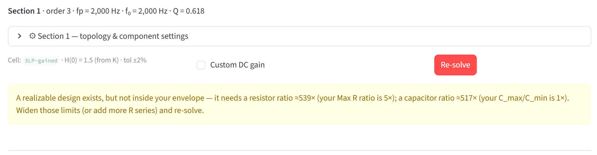

| The app says | What it means | What to do |
|---|---|---|
| No realization inside the component envelope. Widen R/C limits, relax Max R ratio, add more R series, or raise thoroughness. | Nothing found, and the check reached no verdict. | In that order. |
| A realizable design exists, but not inside your envelope — it needs a resistor ratio ≈N× (your Max R ratio is M×); a capacitor ratio ≈…× (your C_max/C_min is …×). … | The design needs a wider spread than you allow; each part names the limit that stops it. | Raise Max R ratio above N; widen C_min…C_max beyond the capacitor ratio named. |
| A realizable design exists inside your envelope (it needs only …), but the search didn't reach it. … | The limits are fine; the search missed it. | Search thoroughness → Thorough and re-solve, or nudge the section gain slightly. |
| A realizable design almost certainly exists at this gain (…), but the search didn't find one in your envelope. … | The same, found by a gain-band check. | The same. |
| No realizable solution at this gain. You asked for X, but the nearest gain this topology can realize for the target shape is ≈Y. … | This family cannot make this gain with this f₀ and Q (and f_z). | Set the section gain to about Y with Custom gain and move the difference to another section, or change the family. |
| No realizable solution exists for these targets — the pole/zero shape itself isn't achievable with this topology. Choose another topology. | Structural. | Change the family (§4). |
| No realization fits the constraints — raise C_max, add a resistor E-series, or (ni-gained) relax the gain so R3+R4 lands in 5k–50k. | A 1st-order section found no parts. | As it says. |

## 6.5 Results and the report

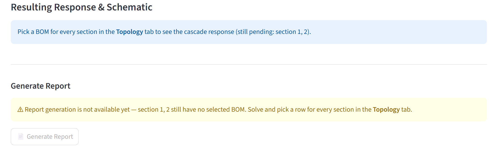

| The app says | What it means | What to do |
|---|---|---|
| Select a solution for every section to see the overall gain (still pending: section N). | Tab 4's Overall filter waits for picks. | Tick a row in each section listed. |
| ⚠ Output is inverted — an odd number of inverting (inv) stages gives overall sign −1. … | The cascade inverts. | Make the count of inverting sections even (family or Realization), or add an inverter. |
| Finalize the cascade and synthesize sections in the Topology tab first — this view combines the selected per-section BOMs. | No cascade yet. | Tabs 3 and 4 first. |
| Pick a BOM for every section in the Topology tab to see the cascade response (still pending: section N). | Solved is not picked. | Tick a row in each section listed. |
| ⚠ Report generation is not available yet — section N still has no selected BOM. … | The same gate, for the report. | The same. |
| Section N: can't build response for `cell` (…). | The response model of that cell failed. | Pick another row; report it (§6.7). |
| ⚠ HF resonance (~N dB at F) … / ⚠ HF rise (~N dB at F) … | Op-amp output resistance (§5). | A lower-Rₒ op-amp, or MFB for the AM sections named. |
| Inputs changed since the last run — click Run Monte-Carlo to refresh the band. | The band on screen is stale. | Run Monte-Carlo again. |
| Monte-Carlo failed: … | | Report it. |
| Monte-Carlo has not been run (or its inputs changed). Generating the report will run it once with the settings above — this adds a few seconds. | Informational. | — |
| Settings changed since this PDF was built — press Generate Report again to refresh it. | The download button still offers the older PDF. | Generate again. |
| Report generation failed: … | | Report it. |
| PDF report support needs the `reportlab` package, which is not installed in this environment. | Optional packages missing (source install). | `pip install reportlab matplotlib cairosvg` |
| Report data is not being published by `app.py` — missing … | The installation is incomplete or modified. | Reinstall. |
| ⚠ Schematic SVG not found … expected `…` in `…`. | The drawing for that cell is missing. | Restore the Section_Schematic_Diagrams folder (§7.4). |

## 6.6 Errors with a Details box

**Engine Error: …** (under the title) and **Solver error: …** (in a section)
each come with a collapsed **Details (paste this into a bug report)** box
holding the technical trace. The first is the approximation engine, the
second the hardware solver. Neither is your fault; report both (§6.7).

## 6.7 Reporting a problem

Include:

- the app version from the title line (*Filter Synthesizer v1.0.3 - …*);
- the specification — the sidebar, or page 2 of a PDF report;
- the section's header line (order, fp, f₀, Q, f_z) and a screenshot of its
  open settings expander;
- the text of the **Details** box, when there is one;
- for the packaged app, the output of `FilterSynthesizer.exe --selftest`,
  which writes a diagnostic report without starting the app.

A maintainer may ask you to start the app with the environment variable
`FILTERSYNTHESIZER_DEBUG=1`; each section then shows a **🔧 exact solver call**
panel whose contents belong in the report.

## 6.8 No ⬇ PNG button next to ⬇ SVG

The PNG button appears only when the `cairosvg` package can render — it is a
live indicator. Without it you lose the PNG downloads, and the report's
schematic pages print a placeholder; everything else works. From source:
`pip install cairosvg` (on Windows it also needs the Cairo library). In the
packaged app, use the SVG.

# 7. Reference tables

## 7.1 E-series

| Series | Values per decade | Usual tolerance class | Offered for |
|---|---|---|---|
| E3 | 3 | wider than ±20 % | capacitors (not usable yet) |
| E6 | 6 | ±20 % | capacitors |
| E12 | 12 | ±10 % | capacitors, resistors |
| E24 | 24 | ±5 % | resistors |
| E48 | 48 | ±2 % | resistors |
| E96 | 96 | ±1 % | resistors |

The series decides which values the solver may use. The tolerance of the parts
you actually buy goes into Tab 5's Monte-Carlo.

## 7.2 Defaults

| Setting | Default | In real parts |
|---|---|---|
| C_min … C_max | 6.80e-05 … 1.00e-02 µF | 68 pF … 10 nF |
| R_min … R_max | 0.3 … 2000 kΩ | 300 Ω … 2 MΩ |
| Max R ratio | 500 | |
| Capacitor / resistor series | E12 / E48 | |
| Family / op-amp | VCVS / Ideal | |
| Monte-Carlo | R 1 %, C 5 %, Gaussian, 2000 runs, seed 0, p1–p99 | |

## 7.3 Reading a cell name

| Part | Means | Examples |
|---|---|---|
| Leading digit | Section order | `2LP-unity`, `3LP-gained` |
| LP, HP, BP, N | Low-pass, high-pass, band-pass, pure notch | `2HP-gained`, `2BP`, `2N` |
| n after LP or HP | With a notch (a zero pair) | `2LPn-unity`, `3HPn-MFB` |
| 2BP1LP, 2BP1HP | Band-pass pair plus an absorbed low- or high-pass pole: a 3rd-order band-pass | `2BP1HP-MFB` |
| -unity, -gained, -atten | VCVS gain variant: = 1, > 1, < 1 | `2LP-atten` |
| -MFB, -AM | Family; no suffix means VCVS | `2LP-MFB`, `3LP-AM` |
| -MFB2, -AM2 | The family's second realization: MFB2 the unity/gained HP-notch, AM2 the alternative output tap | `2HPn-MFB2`, `2LP-AM2` |
| -QE | Q-enhanced twin (positive feedback) | `2BP-MFB-QE` |
| -LS | Lower-sensitivity branch | `2LPn-MFB-LS` |
| +R1, +R7, +R8 | Twin with one extra resistor | `2LPn-MFB-LS+R7` |
| -C1s | Input capacitor split into a parallel pair | `2HP-AM-C1s` |
| 1LP-ni, 1LP-inv | 1st order, non-inverting / inverting, then the gain variant | `1LP-ni-gained` |

## 7.4 Files and folders

| Where | What |
|---|---|
| The folder holding FilterSynthesizer.exe | `_internal` (must stay next to the EXE) and `Section_Schematic_Diagrams` — the schematic drawings, one `.drawio.svg` per cell. A drawing dropped there is used without a rebuild. |
| `%LOCALAPPDATA%\FilterSynthesizer` (Windows); `$XDG_DATA_HOME/FilterSynthesizer` or `~/.local/share/FilterSynthesizer` (Linux) | The symbolic transfer-function cache and logs. Safe to delete; the next start is slow again (10–20 s instead of 2–4 s). Running from source, the cache sits in the app folder. |
| Your browser's download folder | Reports, SVG and PNG schematics. |

## 7.5 Optional packages

| Package | Without it |
|---|---|
| reportlab, matplotlib | No PDF report. The report block names the missing package and the pip line. |
| cairosvg | No ⬇ PNG schematics; the report's schematic pages print a placeholder. |

All three are in `requirements.txt`; the usual casualty is cairosvg, which
needs the Cairo library on Windows.

# 8. What the PDF report contains

A4, the plot pages in landscape. Every page carries a footer: report title ·
date and time · design hash · page. The design hash identifies the cascade —
two reports with the same hash describe the same sections and gains.

| Part | Contents | Controlled by |
|---|---|---|
| Cover | Project (or *Active Filter Design*), the subtitle *Response Type · order N · corner*, author, date, app version | Cover page |
| 1 · Design specification | Every sidebar value, and the calculated stopband edge(s) | always |
| 2 · Transfer function | H(s), denormalized in rad/s, with the gain constant K; 2a monic coefficients; 2b coefficients with K folded into the numerator | 2a/2b: Polynomial coefficient table |
| 3 · Pole–zero map — section pairing | Each section's roots in its colour; dashed links pair poles with zeros; dotted circles mark each section's ω₀ | always |
| 4 · Root locations | Poles and zeros in rad/s with their section; 4a the normalized roots | 4a: Normalized prototype roots |
| 5.N · Section N — cell | Design parameters (order, f₀, ω₀, Q, f_z, f_p, Kᵢ, Peak \|H\|); schematic; BOM with the pre-snap ideal in brackets; op-amp; solver constraints; quality metrics; the section's H(s) | Quality metrics: Per-section quality metrics |
| 6 · Bode — design vs realized | Cascade magnitude with the Monte-Carlo band and its parameters; the passband-gain table | Phase & group delay on Bode page; Monte-Carlo band + parameters |
| 7 · Passband detail | Design vs realized over the band of interest, same shading (*Stopband detail* for a band-reject) | Passband detail plot |
| Design warnings | The HF-resonance notes, when any were raised | Design warnings |

**Gain error in the quality metrics.** With a single section it is measured
against the specified filter gain. In a cascade each section carries only its
share, so it is measured against that section's own design target. *DC gain
(design)* is evaluated at the section's passband reference — f₀ for a
band-pass, DC for a low-pass, HF for a high-pass; on a 3rd-order section the
absorbed pole tilts the response, so it sits slightly below Peak \|H\|. *DC
gain (realized)* uses the snapped values at zero tolerance.

**Passband gain in §6** is the top of the passband ripple — the highest
magnitude inside the band — found separately for the design, the realized
curve and every Monte-Carlo run. It is not the DC gain: for an even-order
Chebyshev or Elliptic without the even-order modification, DC sits a full
ripple lower. This is also why the report's spread can exceed the DC-gain
spread shown in Tab 5. In the Quick Start example the screen gives 3.14 … 3.75 dB
at DC, while the report's highest per-run peak is +5.07 dB: tolerances raise a
peak below the corner, and the report's table shows the peaks landing anywhere
from 200 Hz to 1.53 kHz.
