<!-- Maintenance: every control's session-state key appears in backticks
     exactly once in this file (§3). docs/manual/tools/doc_drift.py relies on
     that to report what a UI change broke — see DOC_WORKFLOW.md.
     §6 quotes messages verbatim: that is what a stuck reader searches for. -->

# 1. How the app is organized

The sidebar holds the specification. The four tabs turn it into hardware, left
to right. Everything recomputes as you edit; there is no Run button.

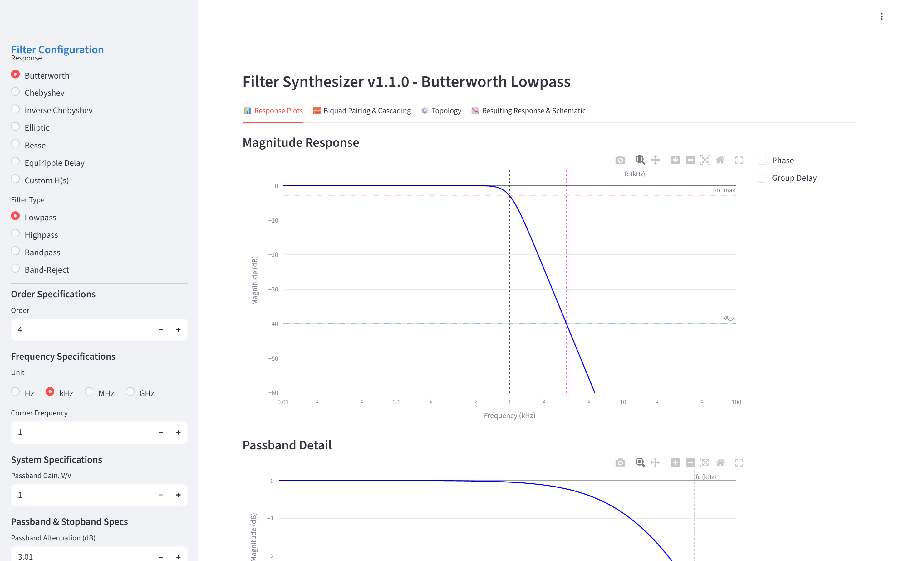

| Tab | What it does | What it needs first |
|---|---|---|
| 📊 Response Plots | Magnitude of the approximation, with phase and group delay on request; group-delay detail for the delay responses; frequency probes; manual notches; at the end, the roots and H(s). For **Custom H(s)** it starts with the panel where H(s) is typed in | A valid specification |
| 🧱 Biquad Pairing & Cascading | Groups the roots into sections and shares out the gain; hands the cascade to the Topology tab | Every zero assigned to a section |
| ⚙️ Topology | Per section: circuit family, op-amp, component limits; **solve**, then **pick** one BOM | The cascade from Tab 2 |
| 📉 Resulting Response & Schematic | The cascade built from your picks: Bode plot, Monte-Carlo, LTspice export, PDF report | A picked BOM in every section |

In this manual the tabs are numbered in that order: Tab 1 is Response Plots,
Tab 4 is Resulting Response & Schematic.

Tabs 1 and 2 are mathematics and update at once, so that is where to iterate
on order, corner and gain. Tab 3 is where time is spent: each section is solved
on its own, and solving does not choose anything — you pick a row. Tab 4 and
the report stay blocked until every section has a pick, and say which sections
are still missing.

**The colour code.** A box with a **blue** border and tint holds controls that
change the design: manual notches, the pairing and gain distribution, the
convergence and section settings, the Monte-Carlo tolerances, the Custom H(s)
panel. An **amber** box is where you pick one of the solver's results — the BOM
table in Tab 3. Everything outside these boxes only displays.

## What persists and what resets

- **The design is not saved to disk.** It lives in the browser session.
  Reloading the page (F5) starts over: the sidebar returns to its defaults and
  every section has to be solved again. The PDF report is the record of a design.
- **The approximation recomputes a moment after each sidebar edit.** A
  specification you have used before comes back instantly from a cache.
- **Solving runs in the background.** Other sections and tabs stay usable
  while a section solves. Sections solve in parallel, one processor core each,
  with one core kept free for the app: on an 8-core machine up to seven
  sections solve at once, and further ones wait in a queue. The tab header
  shows how many are solving and how many are queued.
- **The Topology tab refreshes itself every two seconds** while a solve is
  running — that is how finished solves appear without a click.
- **Results are remembered per configuration.** A section's results belong to
  everything that produced them: its f₀, Q and gain, the envelope, the E-series,
  the op-amp and the convergence settings. Change any of these and the table
  disappears and the button reads **Solve section** again; change it back and
  the earlier table returns without a new solve.
- **A pick belongs to the section number.** It survives re-sorting the table
  and switching tabs. After changing the specification, solve and pick every
  section again — until you do, a section keeps its previous pick, and Tab 4 and
  the report use those parts.
- **Switching the Response keeps what you typed.** The Custom H(s) panel, the
  delay settings and the order survive a switch to another response and back.
  The op-amp library and imported vendor SPICE models are the only things kept
  on disk (§7.4).

# 2. Concepts and vocabulary

| Term | Means |
|---|---|
| Section (stage) | One block of the cascade, realized by one circuit: a complex pole pair (2nd order), a pole pair with an absorbed real pole (3rd order), or a lone real pole (1st order). Zeros assigned to it make it a notch, high-pass or band-pass section. Sections are numbered by rising Q. |
| Absorption | An odd order leaves a real pole. Absorbing it into a pole-pair section makes that section 3rd order and saves an op-amp. Switched on in Tab 2; off by default. |
| f₀, Q, fp, f_z | A section's pole-pair frequency and quality factor; fp is its real pole (absorbed or lone); f_z its notch frequency. Shown in each section's header in Tab 3. |
| Kᵢ | A section's gain constant — the leading coefficient of its transfer function, set by Tab 2's gain distribution. Tab 3 shows the passband gain it implies: H(0) for a low-pass, H(∞) for a high-pass, \|H(f₀)\| for a band-pass. |
| Group delay τ(f) | How long the filter delays a signal at frequency f: the negative slope of the phase. A flat τ keeps a pulse's shape. **Bessel** makes τ maximally flat, **Equiripple Delay** lets it ripple by ±δ to get a sharper magnitude. τ₀ is the nominal delay — τ(0) for a low-pass. |
| Lowpass prototype | A normalized low-pass whose passband edge is at ω = 1 rad/s. The app maps it to the chosen filter type and frequencies. Custom H(s) can take one directly, or a complete H(s) that is already the final filter. |
| Cell | A named circuit that realizes a section, e.g. `3LP-gained` or `2BP-MFB-QE`. The name encodes order, response and variant (§7.3). |
| BOM (candidate) | One complete set of component values for a section. A solve returns many, ranked. |
| Envelope | The limits a BOM must respect: C_min…C_max, R_min…R_max, Max R ratio, and the E-series (or your custom capacitor list). |
| Snapping | Resistors are solved as continuous values, then moved to values of your resistor E-series. Capacitors are taken from their E-series (or your custom capacitor list) from the start and are never snapped. |
| Sens (sensitivity score) | How strongly the section's transfer-function coefficients move when a component drifts by 1 %. Lower is better. A ranking figure, not a predicted tolerance — Monte-Carlo in Tab 4 is that. |
| Snap cost | How far the snapped parts leave the section from its target: a weighted sum of the fractional errors in gain, pole frequency, Q and notch depth. 0 is perfect, lower is better. Like Sens, it ranks; it is not a percentage. |
| Design vs realized | Design is the mathematical target (blue curves). Realized is what the snapped parts do with the chosen op-amp model (red curves). |
| Sign | Inverting cells contribute −1 to the cascade. An odd number of them inverts the output. |

# 3. Control reference

One table per tab, top to bottom as on screen. The **Key** column is the
control's internal name; quote it when reporting a problem. In keys, `*`
stands for the section number (or a band or notch index). Controls without a
key show "—".

## 3.1 Sidebar — the specification

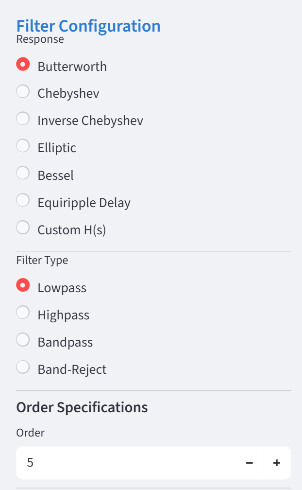 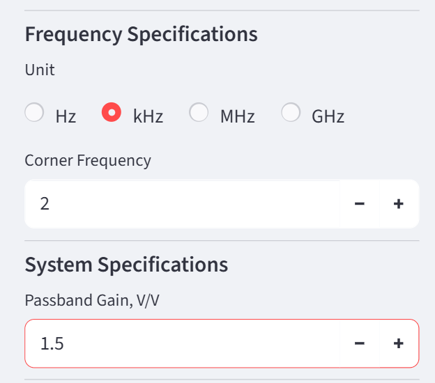

| Control | Key | Default | What it does |
|---|---|---|---|
| Response | — | Butterworth | The approximation: Butterworth (maximally flat), Chebyshev (passband ripple), Inverse Chebyshev (flat passband, notched stopband), Elliptic (ripple in both, steepest), Bessel (maximally flat group delay), Equiripple Delay (group delay within ±δ), or Custom H(s) (your own transfer function). Changes the order limits and which boxes appear below. The delay responses and Custom H(s) have sidebars of their own — see the two sections after this table. |
| Filter Type | `widget_filter_type` | Lowpass | Lowpass, Highpass, Bandpass, Band-Reject. The band types take two corners and an order per side. For Bessel and Equiripple Delay the radio is `widget_filter_type_delay` and offers only Lowpass and Bandpass; a caption says why. The choice is kept across the switch: a type the new response does not offer falls back to Lowpass. |
| Order | `widget_sym_order` | 4 | Filter order. For the band types it is the order of each side, labelled **Order (LP & HP)**. Limits below. |
| Asymmetric | `is_asym_checkbox` | off | Band types only (not for a Chebyshev or Elliptic band-reject): separate orders for the two sides. |
| LP Order / HP Order | `widget_lp_order`, `widget_hp_order` | 4 / 4 | Shown when **Asymmetric** is ticked. LP is the upper-edge side, HP the lower-edge side. |
| Unit | — | kHz | Unit of every frequency box and of the Tab 1 probes. |
| Corner Frequency | `widget_fc` | 1 | Lowpass and Highpass: the passband edge. |
| Lower / Upper Passband Corner | `widget_f1`, `widget_f2` | 1 / 2 | Band types: the two passband edges. |
| Passband Gain, V/V | `widget_gain` | 1 | Overall passband gain, at least 1. Tab 2 shares it out among the sections. |
| Passband Attenuation (dB) | — | 3.0103 | Butterworth, Inverse Chebyshev, Bessel and Equiripple Delay: attenuation at the corner. 0.01–12 dB. For the delay responses it defines where the corner is, so it also moves the poles. |
| Passband Ripple α_max (dB) | — | 1.0 | Chebyshev and Elliptic: the passband ripple, in the same box. |
| Stopband Attenuation A_s (dB) | `sym_as_val` | 40 | Minimum stopband attenuation, 10 dB or more. For Inverse Chebyshev and Elliptic it shapes the design; for Butterworth and Chebyshev it only sets the reported stopband edge f_s and the green line on the plot. For Bessel and Equiripple Delay it is the A_s of the stopband order criterion and of the equiripple stopband (§3.2). The key applies to the Inverse Chebyshev and Elliptic band types; elsewhere the box has none. |
| Lower Stopband A_sl / Upper Stopband A_su (dB) | `as_sl_val`, `as_su_val` | 40 / 40 | Inverse Chebyshev and Elliptic band types with **Asymmetric** ticked: one attenuation per stopband. |
| Response Modifications | — | off | Checkboxes that appear only where they apply — see below. |

### Order limits

| Response | Lowpass / Highpass | Bandpass, per side | Band-Reject, per side | Asymmetric, per side |
|---|---|---|---|---|
| Butterworth | 1–20 | 1–15 | 1–14 | 1–14 |
| Chebyshev | 1–20 | 1–20 | 1–16 | 1–10 (Bandpass only) |
| Inverse Chebyshev | 1–20 | 1–20 | 1–20 | 1–10 |
| Elliptic | 2–15 | 2–15 | 2–15 | 1–10 (Bandpass only) |
| Bessel | 1–20 (Lowpass only) | 1–10 (prototype order n) | — | — |
| Equiripple Delay | 1–15 (Lowpass only) | 1–10 (prototype order n) | — | — |
| Custom H(s), prototype | 1–20 | 1–15 | 1–15 | — |
| Custom H(s), complete | at most 30 poles in all | | | |

A value outside the new limits is clamped when you change the response. A
delay bandpass is made from a low-pass prototype of order n and has order 2n.

### Coupled behaviour worth knowing

- **The two corners push each other apart.** Raising the lower corner to or
  above the upper one moves the upper corner to twice the lower; lowering the
  upper corner to or below the lower one moves the lower corner to half the
  upper.
- **The corner carries over between filter types.** The Lowpass/Highpass
  corner and the lower band corner are the same stored value.
- **The orders stay in step until you edit HP.** The symmetric order and the
  LP order are one value; the HP order follows it until you change HP once,
  after which it keeps its own.
- **Asymmetric stopbands start equal.** Ticking **Asymmetric** copies the
  common A_s into both A_sl and A_su; unticking copies A_sl back.

### Response Modifications

| Checkbox | Appears for | Effect |
|---|---|---|
| Passband Even Order Modification | Chebyshev and Elliptic, even order, all types except Bandpass | An even-order Chebyshev or Elliptic response normally starts in a ripple valley: the gain at DC (at HF for a high-pass) sits one full ripple below the passband peaks. The modification puts it on a peak instead. |
| Lower / Upper Passband Even Ord Mod | Asymmetric Chebyshev or Elliptic Band-Reject, per even-order side | The same, for each passband separately. |
| Stopband Rolloff | Inverse Chebyshev and Elliptic | Moves one pair of transmission zeros to infinity: one notch fewer, and the stopband keeps falling beyond the last notch. |
| Lower / Upper Stopband Rolloff | Asymmetric Inverse Chebyshev or Elliptic Bandpass | The same, for each stopband separately. |
| Coincident Stopband Notches | Inverse Chebyshev and Elliptic Band-Reject, total order divisible by 4 | The zero pair the rolloff would send to infinity lands at the centre of the stopband instead, so two notches coincide there. |

### Validation

An invalid specification replaces the whole main area with a red
**Mathematical Constraint Violation** box (§6.1). The one you can actually hit:
an asymmetric band-reject needs an even total order (LP + HP). Asymmetric
Elliptic Bandpass also warns, without blocking, when LP + HP exceeds 15.

### Bessel and Equiripple Delay

These two responses are designed for their **group delay**, not their
magnitude: Bessel for a delay as flat as possible, Equiripple Delay for a delay
that stays within ±δ of τ₀ over a wider band, bought with a little ripple. Both
are Lowpass or Bandpass only — a high-pass or band-reject passband cannot have a
flat delay. They have no Response Modifications.

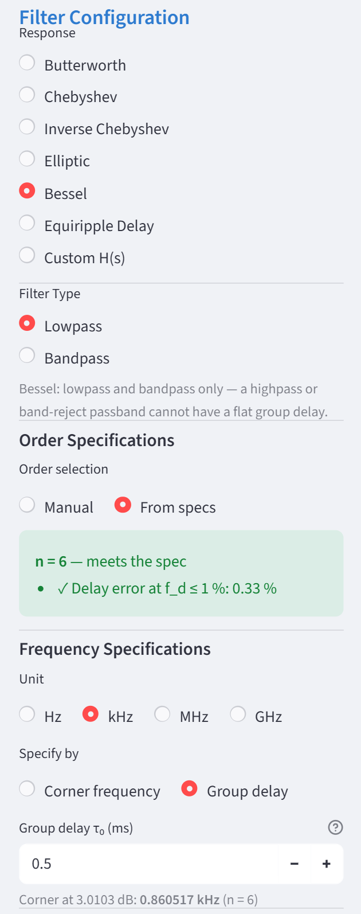 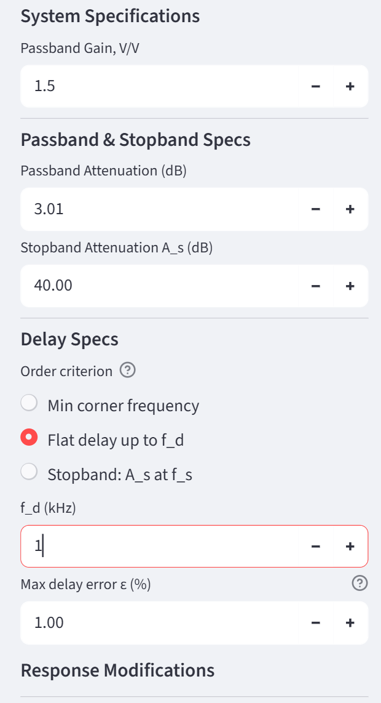

| Control | Key | Default | What it does |
|---|---|---|---|
| Order selection | `widget_delay_order_mode` | Manual | **Manual**: type the order. **From specs**: the app picks the order from one criterion in **Delay Specs** below, and shows the result where the Order box was (below the table). |
| Order / Prototype order n (BP order = 2n) | as above | 4 | Manual mode only. The same stored order as the other responses, clamped to the limits above. |
| Specify by | `widget_delay_anchor` | Corner frequency | Lowpass only. **Corner frequency**: you give f_c, as for any low-pass; τ₀ follows from it. **Group delay**: you give τ₀ and the corner follows from it and the order. |
| Group delay τ₀ | `widget_tau0` | 1 | Shown with **Group delay**. In the reciprocal of the sidebar unit: s for Hz, ms for kHz, µs for MHz, ns for GHz. Held exactly: τ(0) for Bessel, the centre of the ±δ band for Equiripple Delay. The derived corner is printed under it: *Corner at 3.0103 dB: … (n = …)*. |
| Corner Frequency / Lower and Upper Passband Corner | as above | — | As for the other responses (above). The corner is where the response is down by the **Passband Attenuation**. |

**Delay Specs** appears for a bandpass, for Equiripple Delay, and whenever the
order comes from the specification (a manual Bessel low-pass needs none of it):

| Control | Key | Default | What it does |
|---|---|---|---|
| Bandpass mapping | `widget_delay_bp_map` | Delay-preserving (arithmetic) | Bandpass only. **Delay-preserving** moves the low-pass delay shape to the band centre, so the delay stays flat across the band — up to a fractional bandwidth of about 0.3. **Classic (geometric)** is the usual bandpass transform; the delay is tilted across the band. |
| Delay ripple ±δ (%) | `widget_delay_ripple` | 1.00 | Equiripple Delay only: how far τ may deviate from τ₀ in the flat-delay band. 0.05–10 %. Smaller δ approaches Bessel. |
| Order criterion | `widget_crit_*` | first option | From specs, Lowpass. One criterion, one number (rows below). The list depends on **Specify by**: with the corner anchor it starts with **Max group delay (latency budget)**, with the delay anchor with **Min corner frequency**; then **Flat delay up to f_d** and **Stopband: A_s at f_s**. Each anchor keeps its own choice (`widget_crit_corner`, `widget_crit_delay`). A bandpass always uses the stopband criterion, and says so. |
| τ₀ ≤ | `widget_crit_tau_max` | 0.4 | Max group delay: f_c is held, and the app takes the **largest** order whose delay stays within the budget. |
| f_c ≥ | `widget_crit_f_min` | 0.5 | Min corner frequency: τ₀ is held, and the app takes the smallest order whose corner reaches this frequency. |
| f_d | `widget_crit_fd` | 0.5 | Flat delay: the smallest order whose delay stays within tolerance up to f_d. The tolerance is ±δ for Equiripple Delay. |
| Max delay error ε (%) | `widget_crit_eps` | 1.00 | Bessel with the flat-delay criterion: a Bessel delay only sags, so the criterion is τ(f) ≥ (1 − ε)·τ₀ up to f_d. 0.01–50 %. |
| f_s | `widget_crit_fs` | 3 | Stopband: the smallest order with at least A_s (the sidebar's **Stopband Attenuation**) at f_s. For a bandpass f_s must lie outside the passband; one inside is ignored, with a warning. |

**The order result.** In *From specs* mode a box replaces the Order input:
green with **n = …** and one ✓ line per requirement when the criterion is met,
yellow when no allowed order meets it — *no order ≤ … meets the spec; this is
the closest*, the one with the fewest ✗ lines and the smallest shortfall, and
the design uses it — and blue when no order could be selected —
the box says why, and the design keeps the last manual order meanwhile.

**A band too wide for the delay-preserving mapping** stops the design with a red
box naming the B/f₀ limit for that order. Narrow the band, lower the order, or
choose **Classic (geometric)**.

### Custom H(s)

**Custom H(s)** takes a transfer function you already have — from a handbook
table, MATLAB, a paper — instead of one of the built-in approximations. You
type H(s) in a panel at the top of Tab 1 (§3.2); the sidebar holds what it
means. Everything after that — pairing, solving, the report — works as for any
other design.

There are two modes:

- **Lowpass prototype** (the default): you enter a normalized low-pass whose
  passband edge is at ω = 1, choose a Filter Type and its frequencies, and the
  app maps the prototype onto them — as it does internally for the built-in
  responses.
- **Complete H(s)**: what you enter *is* the filter. The app measures its
  passband edges and detects its type; there is no Filter Type radio.

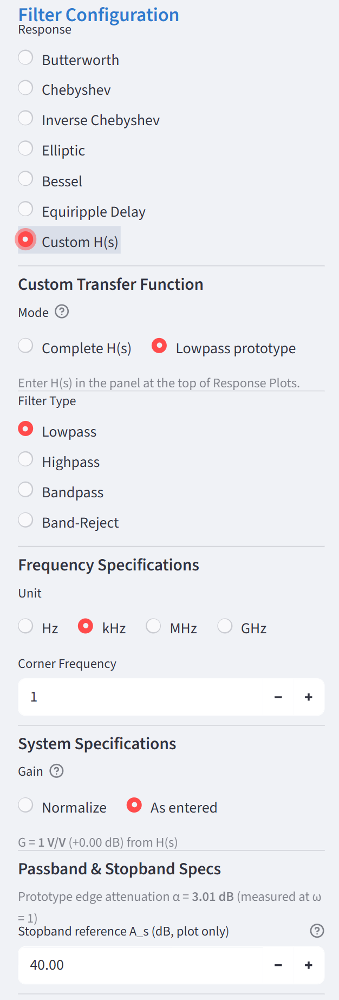

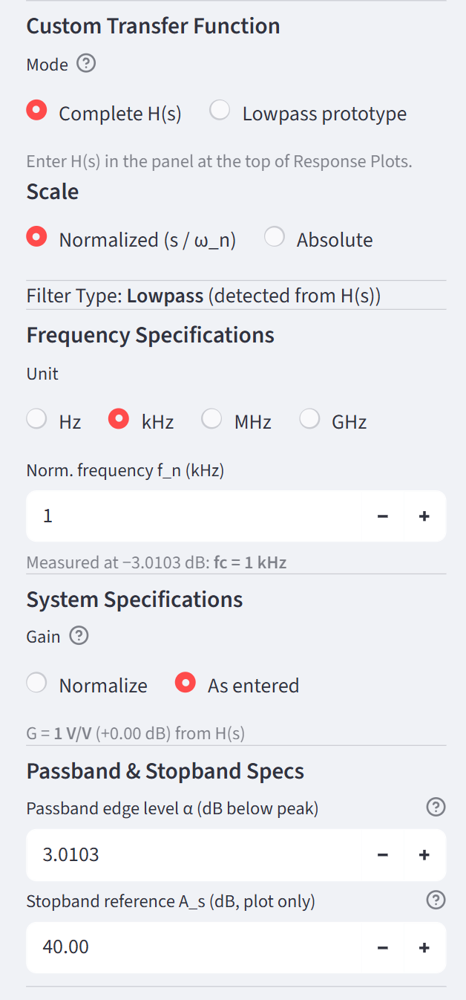 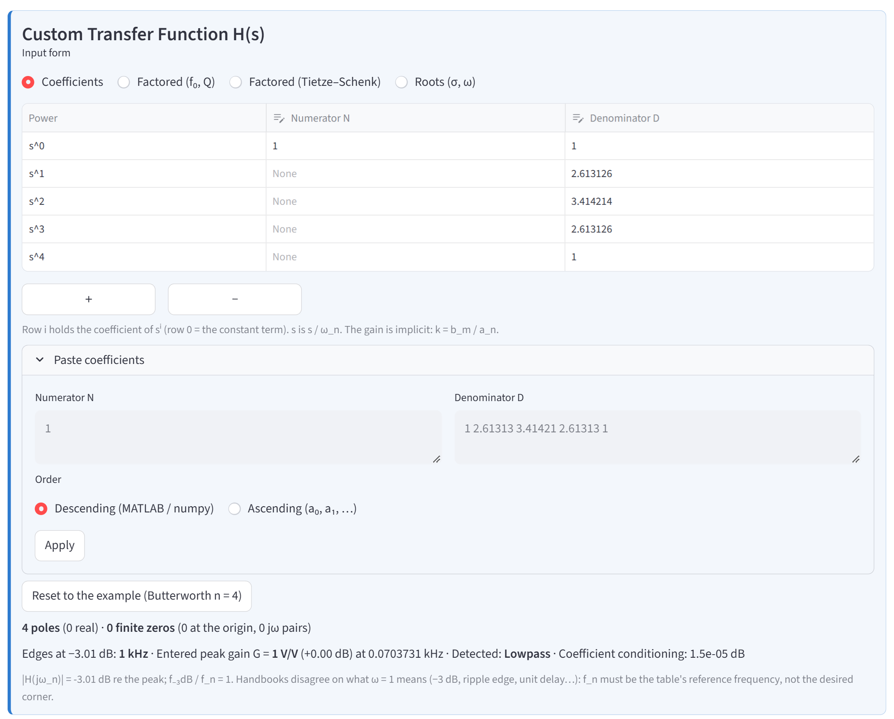

Top to bottom:

| Control | Key | Default | What it does |
|---|---|---|---|
| Mode | `widget_custom_mode` | Lowpass prototype | **Complete H(s)** or **Lowpass prototype**, as above. |
| Scale | `widget_custom_scale` | Normalized (s / ω_n) | Complete mode only. **Normalized**: the entered s is s/ω_n, with ω_n = 2π·f_n from the box below — the way handbook tables are printed. **Absolute**: s in rad/s, as typed. With the Tietze–Schenk form the radio is greyed (`widget_custom_scale_ts`): those tables are always normalized. |
| Filter Type | as above | Lowpass | Prototype mode: the target type, as for the other responses. Complete mode: no radio, but the line *Filter Type: … (detected from H(s))*. A response that is none of the four types stops the design. |
| Unit | — | kHz | As above. |
| Norm. frequency f_n | `widget_custom_fn` | 1 | Complete mode, Normalized scale: the frequency the table's ω = 1 stands for. It must be the table's own reference frequency, not the corner you want: handbooks disagree on what ω = 1 means (−3 dB, ripple edge, unit delay …). Under it, the measured passband edges. |
| Corner Frequency / Lower and Upper Passband Corner | as above | — | Prototype mode: where the prototype's ω = 1 lands. |
| Passband definition | `widget_custom_pbdef` | Corners | Prototype mode, Bandpass and Band-Reject. **Corners**: the lower and upper passband edges. **Normalized width**: **Centre frequency f₀** (the same box as f_n above) and Δ, as in handbook frequency-transformation examples; the derived corners are printed below. |
| Normalized width Δ = (f₂ − f₁) / f₀ | `widget_custom_bw` | 0.5 | With **Normalized width**. The centre is geometric. |
| Gain | `widget_custom_gain_mode` | As entered | **As entered**: the peak gain G of your H(s) is the passband gain, and the sidebar prints *G = … V/V from H(s)*. G may be below 1. **Normalize**: H(s) is scaled so its peak equals the **Passband Gain** box that then appears; K or A₀ in the panel is greyed and recalculated. |
| Passband edge level α (dB below peak) | `widget_custom_alpha` | 3.0103 | Complete mode. The passband edges are the outermost frequencies where \|H\| is α below its peak; the type is detected against the same level. 0.01–40 dB. In prototype mode the box is replaced by the prototype's measured edge attenuation, \|H(j1)\| below its peak. |
| Stopband reference A_s (dB, plot only) | `widget_custom_as` | 40 | Only draws the −A_s line on the plots: the entered H(s) fixes the stopband. |

Custom H(s) has no Order box and no Response Modifications — both are in the
entered H(s). In prototype mode a bandpass or band-reject mapping does not keep
a flat group delay, so a Bessel prototype loses it; the panel says so.

## 3.2 Tab 1 — Response Plots

The tab shows the approximation you specified, top to bottom: the magnitude
plot, a passband detail, the group-delay detail (delay responses only), the
stopband-edge readout, the frequency probes, the manual notches and, at the
end, the roots and the transfer function. For **Custom H(s)** the tab starts
with the panel where H(s) is entered (last part of this section).

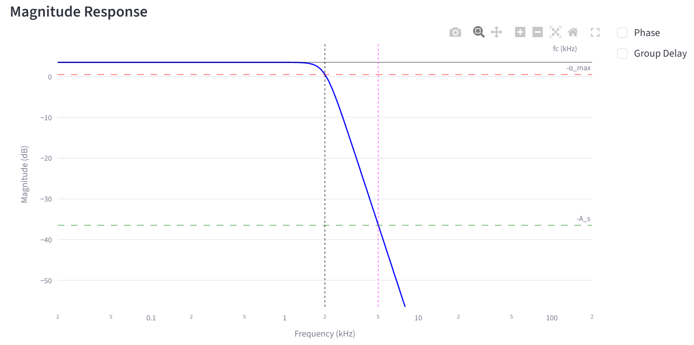

The **Magnitude Response** plot marks −α_max (red dashed), −A_s (green dashed),
the corner (black dashed) and the calculated stopband edge f_s (magenta
dotted). **Passband Detail** below zooms into the passband — for a band-reject,
**Lower Passband** and **Upper Passband** side by side. Under the plots, the
**Calculated Stopband Edge (f_s)** box is green when the stopband meets A_s,
yellow when a pinned notch pushed the edge out, and red when the stopband never
reaches A_s. Custom H(s) has no such box: its stopband is whatever was entered.

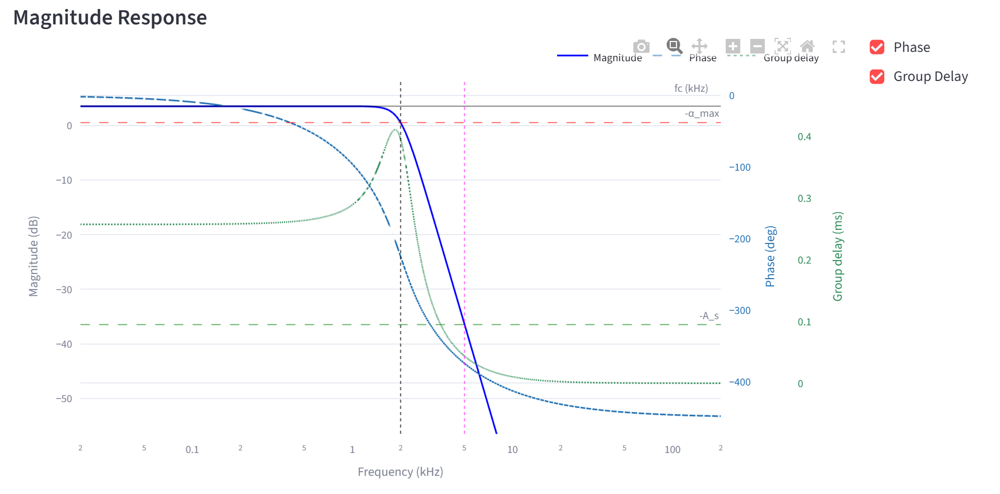

| Control | Key | Default | What it does |
|---|---|---|---|
| Phase | — | off | Overlays the phase (dashed, degrees) on the magnitude plot, on a right-hand axis. |
| Group Delay | — | off | Overlays the group delay (dotted, ms) on its own right-hand axis — next to the phase axis when both are on. The axis is scaled to the bulk of the curve, so the spikes at notch frequencies run off the plot instead of flattening it. |
| Probe 1 / 2 / 3 | `probe_*_*` | corner, 2× and 10× corner (Lowpass) | Gain and phase of the design at the typed frequency, printed beside each box. Each filter type keeps its own probes; the second `*` is the filter type. |
| Pin *N* | `pin_notch_*` | off | Manual notches, one row per zero pair the order allows. Butterworth, Chebyshev, Bessel and Equiripple Delay (**Manual Notch Placement**): an unpinned row reads ∞; pinning adds a finite notch at the typed frequency. Inverse Chebyshev and Elliptic (**Manual Notch Tuning**): unpinned rows show the computed notch; pinning freezes it so you can move it. |
| Notch frequency | `val_notch_*` | 2× corner (Lowpass) | The pinned notch's frequency, in the sidebar unit. |
| Lower / Upper Stopband Notches | `pin_notch_hp_*`, `val_notch_hp_*`, `pin_notch_lp_*`, `val_notch_lp_*` | off | Bandpass: the same, one column per stopband. |
| Equiripple Magnitude Stopband | `widget_ems` | off | Bessel and Equiripple Delay low-pass, with a manual order and the corner anchor (otherwise a one-line note says what it needs). See below. |
| Active *N* | `ems_active_*` | the first ⌊(n − 1)/2⌋ rows, at least one | With the equiripple stopband on, replaces **Pin**: how many notches the app places. Each solved frequency is shown read-only. |

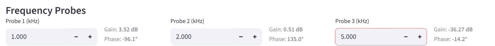

Manual notches are not offered for Elliptic band filters, for Elliptic
Lowpass/Highpass above order 8, for a delay bandpass, or for Custom H(s) (its
zeros are entered in the panel); the tab says so.

**Notches on a delay response** sit in the stopband only: a pinned notch must
lie above the corner, and one in the passband is ignored. Notches add no group
delay. With the corner anchor the poles are scaled to hold the corner, so τ₀
shrinks slightly; with the τ₀ anchor the corner moves instead.

### Equiripple magnitude stopband

A Bessel or Equiripple Delay low-pass has a soft stopband. With **Equiripple
Magnitude Stopband** ticked, the app places the active notches so that every
stopband hump sits exactly at −A_s — an Inverse-Chebyshev-like stopband on a
flat-delay filter. You choose only how many notches: each one costs 40 dB/dec
of far-stopband roll-off. The poles are scaled to keep the corner where it
was, so the delay keeps its shape and τ₀ drops by the scale factor. Your pins
are parked while the mode is on and come back when you switch it off.

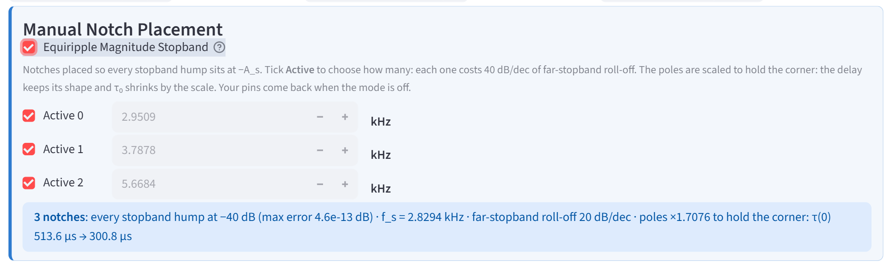

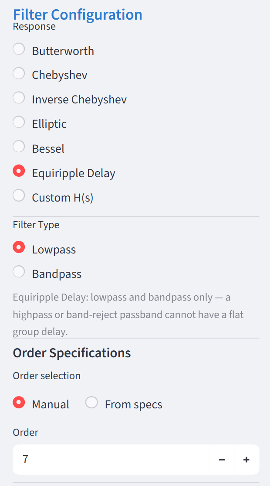 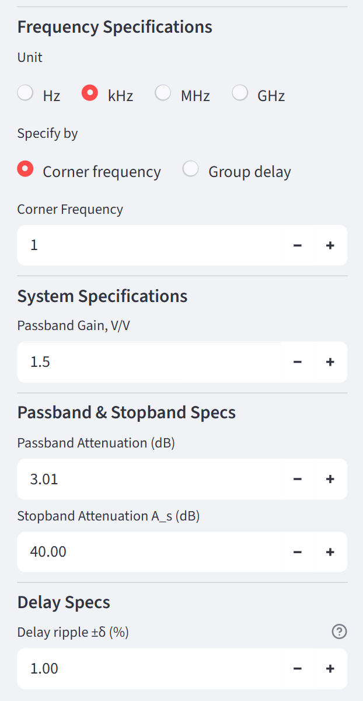

The readout under the rows gives the number of notches, the hump level and the
largest error, f_s, the far-stopband roll-off (or a flat floor at −A_s when
every pole pair has a notch), and the pole scale with τ(0) before → after. It
turns yellow if the notch solve did not converge; with no row active it says
the filter is the plain delay low-pass.

### Group Delay Detail

Shown for Bessel and Equiripple Delay. A row of figures, then a zoomed τ(f)
plot with the tolerance band and the flat-delay edge:

| Figure | Low-pass | Bandpass |
|---|---|---|
| Delay | **Group delay τ(0)**; Equiripple Delay adds **Nominal delay** | **Delay at centre** and **Centre** |
| Corner | **Corner (… dB)** | — |
| Flat band | **Flat delay (±δ or −ε) to** — where τ leaves the tolerance | **Flat delay (±…)** — the band, and **Delay p-p f1…f2**, the peak-to-peak delay variation across the passband |
| **Max section Q** | the highest Q of any pole pair — a first hint of how hard the hardware will be | same |

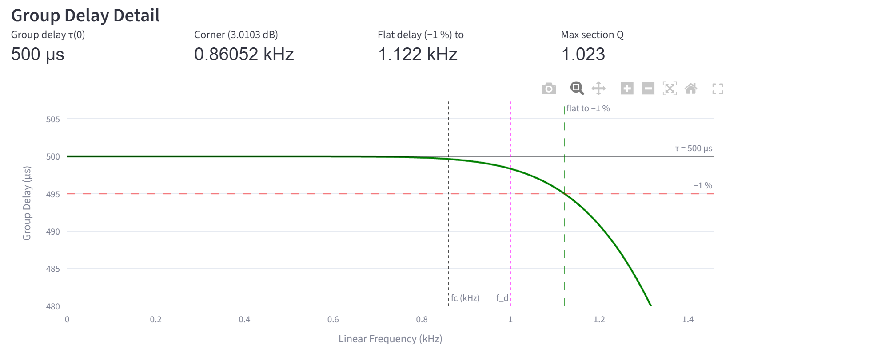

A caption reports the pole scale when notches moved the poles. The plot marks
f_d (magenta dotted) when the flat-delay criterion is in use.

### Roots & Transfer Function

The grey frame at the end of the tab. **Domain Scale** at its top drives
everything inside: the map, the root tables, K and H(s).

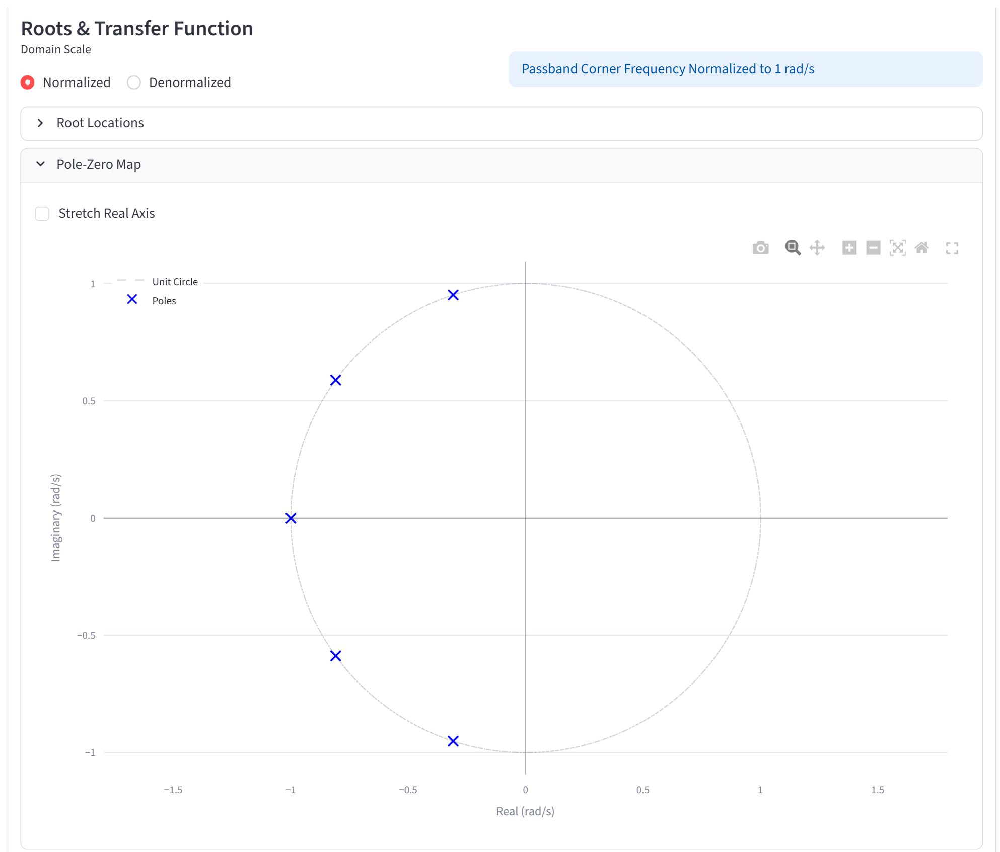

| Control | Key | Default | What it does |
|---|---|---|---|
| Domain Scale | `scale_roots` | Normalized | **Normalized**: corner (band centre for band types) at 1 rad/s, unity gain. For Custom H(s), normalized to ω_n = 2π·f_n, so the tables show what you typed. **Denormalized**: real frequencies, and K includes the passband gain. |
| Pole-Zero Map Units | `unit_roots` | rad/s | Denormalized only: rad/s or Hertz for the map, the tables and H(s). |
| Stretch Real Axis | — | off | Inside **Pole-Zero Map**. Stretches the real axis — useful when poles crowd the imaginary axis. |
| Magnification | — | 1.0 | Shown when stretching: 0.25–10. |
| Form | `tf_form_roots` | Expanded (Isolated Gain) | Inside **Transfer Function H(s)**: **Expanded (Isolated Gain)**, **Expanded (Distributed Gain)** or **Factored (Cascaded Biquads)**. |

Three collapsed expanders follow the scale:

- **Root Locations** — the poles and zeros, and the **System Gain Constant
  (K)** with its units.
- **Pole-Zero Map** — the map, with the stretch control.
- **Transfer Function H(s)** — H(s) in the form the radio picks. The rendered
  equation wraps to fit the page; the grey box under it is the same expression
  as one LaTeX line, ready to copy, followed by the coefficient table.

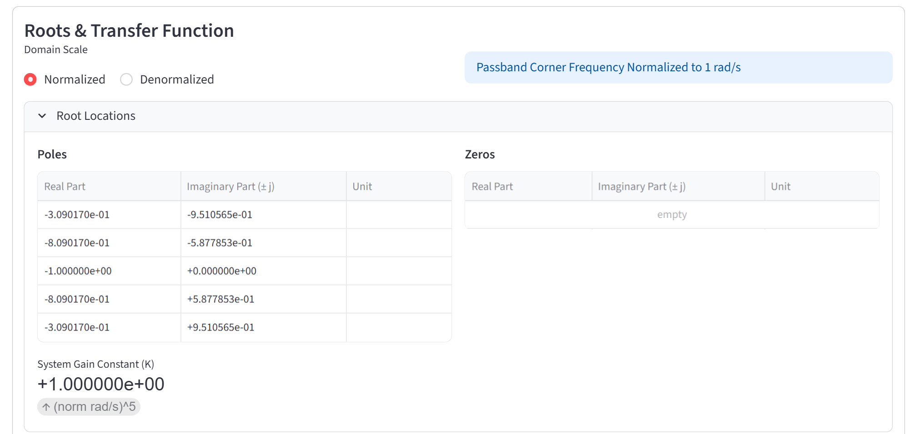

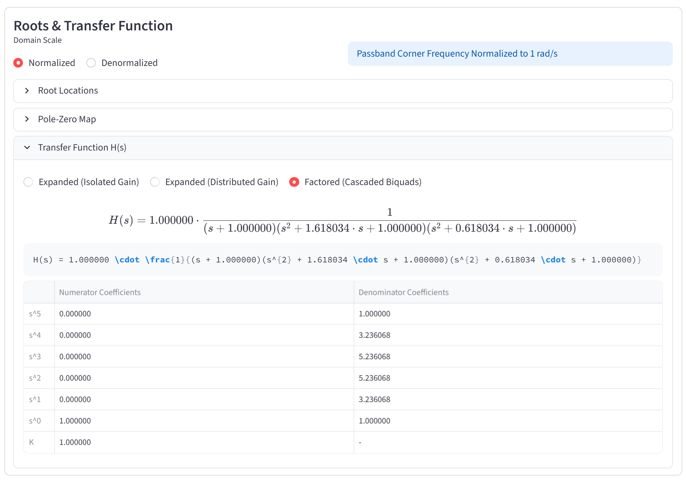

### The Custom H(s) panel

With Response **Custom H(s)**, the tab starts with a blue panel, **Custom
Transfer Function H(s)**, where the transfer function is typed in. Pick the
form your source uses; each form keeps its own entries, so switching does not
convert one into another. Errors stop the design under the panel, so the input
can be fixed in place.

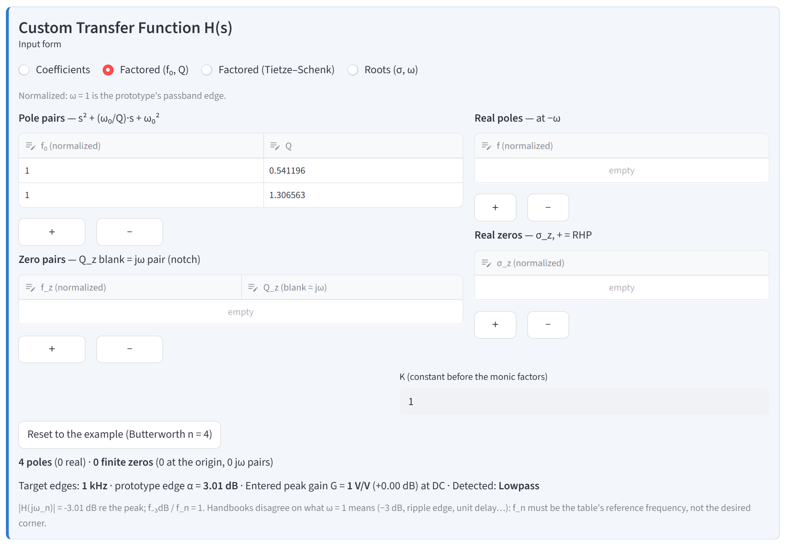

| Control | Key | Default | What it does |
|---|---|---|---|
| Input form | `custom_form` | Factored (f₀, Q) | **Coefficients**, **Factored (f₀, Q)**, **Factored (Tietze–Schenk)** or **Roots (σ, ω)** — below. |
| The tables | `custom_tbl_*_*` | Butterworth n = 4 | One editable table per block of the form. Rows are fixed; type into the cells. Typed text is kept as typed. |
| ＋ / − | `custom_add_*`, `custom_del_*` | — | Under each table: add a row, remove the last row. |
| Zeros at the origin n₀ | `custom_n0` | 0 | Factored (f₀, Q), complete mode only (a low-pass prototype has none). |
| K (constant before the monic factors) | `custom_K_f0q` | 1 | Factored (f₀, Q). |
| A₀ (DC gain) | `custom_A0` | 1 | Tietze–Schenk. |
| K (leading constant) | `custom_K_roots` | 1 | Roots (σ, ω). Labelled **C (leading constant of 1/H, K = 1/C)** in C form. |
| Leading constant | `custom_kform_roots` | K — gain function H(s) | Roots (σ, ω): **K** for H(s) = K·∏(s − zᵢ)/∏(s − pᵢ), or **C — attenuation function 1/H(s) (Saal)** for tables that give 1/H(s) = C·∏(s − pᵢ)/∏(s − zᵢ); then K = 1/C. Switching reinterprets the typed number; it does not convert it. |
| Paste coefficients: Numerator N / Denominator D | `custom_paste_num`, `custom_paste_den` | empty | Coefficients form: paste a whole polynomial: numbers separated by spaces, commas, semicolons or new lines; brackets are ignored, so MATLAB's `[1 2.613 …]` pastes as is. |
| Order | `custom_paste_order` | Descending (MATLAB / numpy) | Order of the pasted coefficients; **Ascending (a₀, a₁, …)** for tables that start with the constant term. |
| Apply | `custom_paste_apply` | — | Writes the pasted polynomials into the table. An empty box leaves its column unchanged. |
| Paste roots: Poles / Zeros | `custom_paste_poles`, `custom_paste_zeros` | empty | Roots form: one root per line — `−0.5+0.866j`, MATLAB's `−0.5000 + 0.8660i`, or `re im`. A full list with both conjugates (the output of `roots(den)`) is de-duplicated. |
| Apply | `custom_paste_apply_roots` | — | Writes the pasted roots into the tables. |
| Reset to the example (Butterworth n = 4) | `custom_reset` | — | Restores the example in every form; keeps the form, scale and f_n. |

**The four forms:**

- **Coefficients** — numerator N and denominator D side by side; row *i* holds
  the coefficient of sⁱ (row 0 is the constant term). The gain is implicit:
  k = b_m / a_n.
- **Factored (f₀, Q)** — pole pairs s² + (ω₀/Q)·s + ω₀² as f₀ and Q; real poles
  at −ω as f; zero pairs as f_z and Q_z (Q_z blank = a pair on the jω axis, a
  notch); real zeros as σ_z (+ = right half-plane).
- **Factored (Tietze–Schenk)** — the all-pole tables of Tietze–Schenk and TI's
  *Op Amps for Everyone*: H(s_n) = A₀ / ∏(1 + aᵢ·s_n + bᵢ·s_n²), one row per
  stage, b = 0 for a real pole. Always normalized. For zeros, use the
  (f₀, Q) form.
- **Roots (σ, ω)** — poles and zeros as real and imaginary parts; ω > 0 stands
  for a conjugate pair.

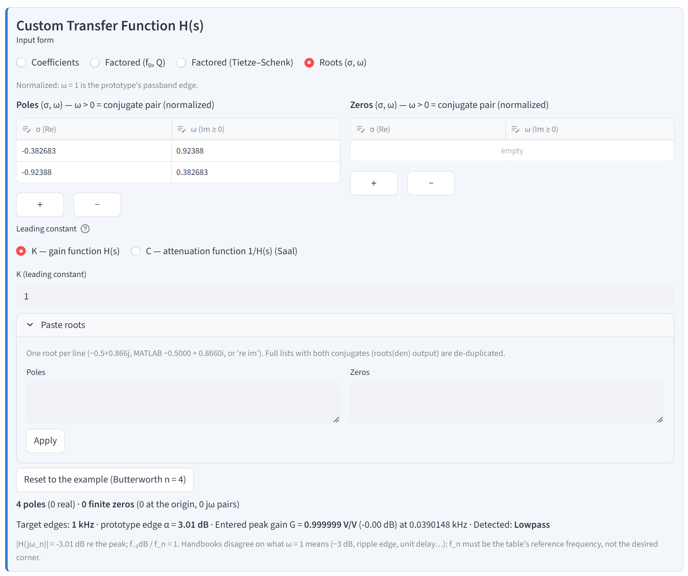

Frequencies are normalized (ω = 1 is the prototype's passband edge) in
prototype mode, multiples of f_n in complete mode with the Normalized scale,
and in the sidebar unit (rad/s for roots and coefficients) with Absolute.

**K and A₀ under Normalize.** With the sidebar's Gain set to **Normalize**,
the constant field is greyed and shows the value that puts the peak of H(s) at
the Passband Gain; the K / C radio is greyed too. Switch Gain to **As entered**
to type it.

**Diagnostics** under the inputs:

- the counts — poles (real ones), finite zeros (at the origin, jω pairs), and
  repeated roots merged;
- the passband edges at −α (complete mode) or the target edges and the
  prototype's own edge attenuation (prototype mode);
- the **entered peak gain G** and where it occurs, the **detected** type, and
  the coefficient conditioning;
- for a normalized entry, \|H(jω_n)\| relative to the peak and f₋₃dB / f_n —
  the quickest check that f_n is the table's reference frequency;
- warnings, and a **Pairing pre-flight** list when the automatic pairing would
  give a section a numerator no circuit realizes.

**What the panel accepts.** The poles must be stable — none at the origin, on
the jω axis or in the right half-plane — and H(s) proper (no more finite zeros
than poles). Zeros must lie on the jω axis or at the origin: a real zero, or a
zero pair off the axis, is refused, because no cell realizes it yet. A complete
H(s) whose response is not a low-pass, high-pass, bandpass or band-reject is
refused too. A negative K is used as \|K\|: the sign is set by the circuits.
Each refusal names the root or row at fault (§6.1).

Elsewhere in the app, a Custom H(s) design differs only in small ways: the
Pairing tab hides **Equalize DC and HF gains** for an asymmetric band-reject,
the Topology tab's overall target gain is the entered G, and the report lists
the entry instead of the approximation's parameters (§8).

## 3.3 Tab 2 — Biquad Pairing & Cascading

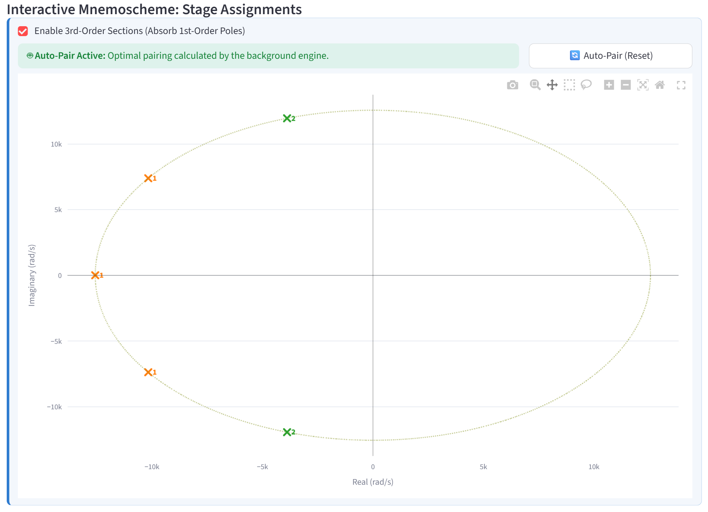

| Control | Key | Default | What it does |
|---|---|---|---|
| Hardware Target Units | `unit_pair` | rad/s | Units of the mnemoscheme and of the section tables below. The Topology tab always works in Hz. |
| Enable 3rd-Order Sections (Absorb 1st-Order Poles) | — | off | Shown only when the filter has a real pole. Ticked: each real pole is absorbed into a pole-pair section, which becomes 3rd order. Unticked: the real pole is a 1st-order section of its own. |
| The mnemoscheme | `pz_mnemo_chart` | automatic pairing | The pole-zero map with each section in its own colour. Clicking edits the pairing (below). |
| 🔄 Auto-Pair (Reset) | — | — | Discards manual edits and restores the automatic pairing. |
| Remaining Gain Distribution | — | Distribute Remaining Gain Evenly | The pairing first sets every section to unity passband gain; the **Calculated Remainder** is the factor still needed to reach the specified passband gain (the gain over unity). This decides where it goes: shared evenly, all to the first stage, or all to the last stage. Band-Reject adds **Equalize DC and HF gains of LP and HP sections**, which makes both passbands land on the specified gain. |

**Editing the pairing by hand.** Click a pole to select it, then click a zero
to move that zero into the pole's section, or a real pole to absorb it (needs
the checkbox), or the same pole again to cancel — or, on an absorbed real pole,
to detach it into its own section. The banner turns to **Manual Override
Active**; sections are renumbered by rising Q after every edit. Until every
zero belongs to a section, the gain distribution and the section tables are
withheld and the cascade is not handed on.

Each section below the map shows its transfer function (rendered and as a
LaTeX line) and a table: Kᵢ, ω₀ or f₀, Q, the notch ωz or fz, the real pole ωp
where there is one, and **Peak Mag (V/V)** — the section's own maximum gain.

## 3.4 Tab 3 — Topology & Hardware Synthesis

Each section has a header line — order, fp for a real pole, f₀, Q, and f_z for
a notch — then a blue box with its settings expander, its gain control, the
cell caption and the **Solve section** button. The caption names the cell the
gain selects, e.g. *Cell: `3LP-gained` · H(0) = 1.5 (from K) · tol ±2%*: a
section gain within ±2 % of 1 uses the unity cell, above it the gained cell,
below it an attenuating cell. Below the box, once solved, the amber box with
the candidates table.

At the top of the tab, above **Convergence Settings**, the **Batch mode**
switch decides whether each section has its own op-amp and component envelope
(off, the default) or all sections share one (on). Below it, **Custom
capacitor values** holds the one capacitor list the design uses for every
section whose capacitor series is **Custom**.

### Custom capacitor values

| Control | Key | Default | What it does |
|---|---|---|---|
| Capacitor values | `hw_cap_custom` | 100p, 220p, 470p, 1n, 2.2n, 4.7n, 10n | The capacitor values you stock. Type them with a p / n / u (or µ) suffix and an optional F — `100p`, `4.7n`, `4.7 nF`, `4n7`, `1u` — separated by commas, semicolons or spaces. They are sorted and duplicates dropped; the caption shows the list in use. Values are used **exactly as given**: unlike an E-series, `4.7n` does not also give 47n or 470p. A section on **Custom** uses only these values for every capacitor (two of them in parallel where a cell splits a capacitor), and C_min / C_max do not apply to it — the list's smallest and largest values are its capacitor range. Changing the list re-solves those sections; setting it back brings the earlier results back. Needs at least two values spanning at least 1.5×; an invalid entry is reported and the previous list stays in use. |

### Batch mode

| Control | Key | Default | What it does |
|---|---|---|---|
| Batch mode — shared envelope & op-amp | `hw_batch` | off | On: one op-amp and one component envelope — C and R range, Max R ratio, E-series — for every section, set once in **⚙ Shared settings — all sections (Batch mode)**, and a **Solve all sections** button. Each section keeps its own topology family, family options and gain, and you still pick a row in each section. |
| Solve all sections | `hw_solve_all` | — | Batch mode only. Queues every section that has no result for its current settings; they solve in parallel, one core each (§1). A section that already has a result keeps it — use its own **Re-solve** to repeat it. |

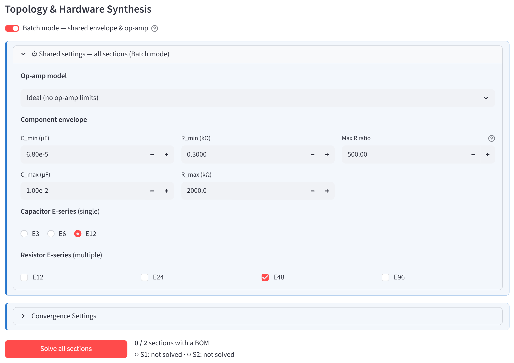

Beside the button a status line counts the sections that have a BOM, how many
are solving or queued and how many parallel workers there are, then one entry
per section: ✅ with its BOM count, ⚙️ solving, ⏳ queued, ○ not solved yet,
⚠️ no BOM, not solvable, or an error.

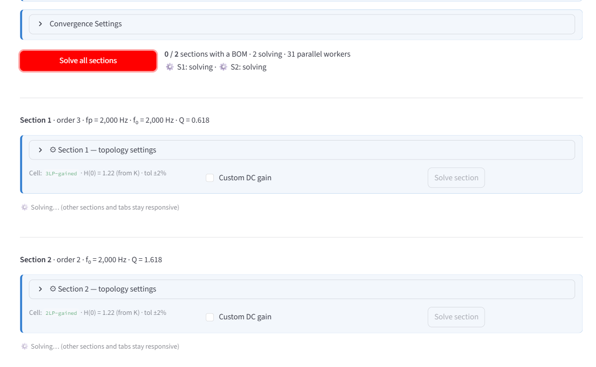

**Switching is lossless.** The first time Batch mode is switched on, the shared
settings start from the first section's values. Each section's own values are
kept while Batch mode is on and come back when it is switched off; the shared
values are kept too. Because results belong to their settings (§1), switching
may show **Solve section** again on sections whose own settings differ from the
shared ones — switching back brings their tables back.

With Batch mode on, each section's expander reads **⚙ Section N — topology
settings** and holds only the family and its options; a caption points to the
shared box.

### Convergence Settings

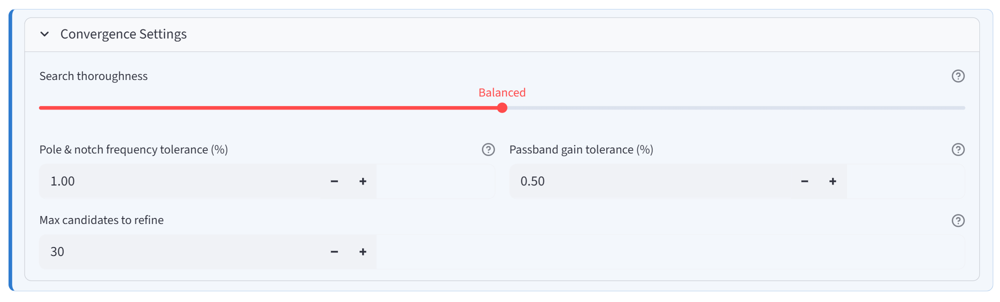

These apply to every section.

| Control | Key | Default | What it does |
|---|---|---|---|
| Search thoroughness | `hw_effort` | Balanced | Fast / Balanced / Thorough: how many starting points the search tries and how many minima it keeps. Thorough finds more candidates and takes longer. |
| Pole & notch frequency tolerance (%) | `hw_pole_tol_pct` | 1.00 | How far a candidate's realized f₀ — and a notch section's f_z — may sit from the target; used by the notch search path. Q is not gated by it. |
| Passband gain tolerance (%) | `hw_gain_tol_pct` | 0.50 | How far a candidate's realized passband gain may sit from the target: DC gain for low-pass and notch cells, HF gain for high-pass. |
| Max candidates to refine | `hw_topk` | 30 | Only the best N ideal solutions, by sensitivity, are corrected for the op-amp and snapped — the expensive step for gained and notch cells. Lower is much faster and lists fewer BOMs. 1–500. |

Leave these alone until a solve returns nothing *and* the envelope is already
wide; then raise **Search thoroughness**. Lower **Max candidates to refine**
when a gained or notch section is slow. Loosening the tolerances admits
candidates that miss the target by more — a last resort.

### Per-section settings

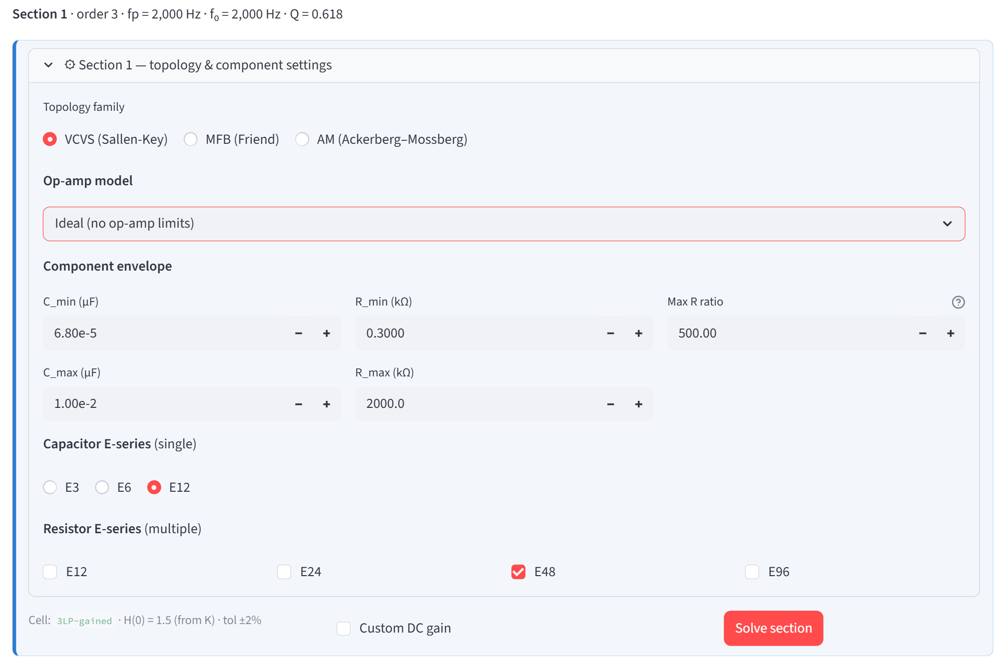

**⚙ Section N — topology & component settings** (Batch mode off). In Batch
mode the op-amp, envelope and E-series rows move to the shared box, with the
same keys ending in the shared tag instead of the section number.

| Control | Key | Default | What it does |
|---|---|---|---|
| Topology family | `hw_fam_*` | VCVS (Sallen-Key); MFB for a 3rd-order band-pass | VCVS (Sallen-Key), MFB (Friend) or AM (Ackerberg–Mossberg). §4 helps choose. A 3rd-order band-pass section has cells only in MFB, so it starts on MFB; a later choice of yours stays. |
| Op-amp model | `hw_opamp_choice_*` | Ideal (no op-amp limits) | **Ideal**, a library part, or **Custom…** — see *The op-amp library* below. With a real part the solver corrects for it and checks the BOM against its non-ideal model (§5). Under the picker a caption gives the part's A_ol, GBWP, Ro and origin (built-in, built-in · edited, or user part). |
| A_ol (V/V), GBWP (Hz), Ro (Ω) | `hw_aol_*`, `hw_gbwp_*`, `hw_ro_*` | 1e5, 1e6, 1200 | **Custom…** only: open-loop gain, gain-bandwidth product, output resistance. |
| C_min, C_max (µF) | `hw_cmin_*`, `hw_cmax_*` | 6.80e-05, 1.00e-02 | Capacitor window: 68 pF to 10 nF. Hidden when the capacitor series is **Custom**: a caption shows the custom list's range instead, and your values come back when you switch to an E-series. |
| R_min, R_max (kΩ) | `hw_rmin_*`, `hw_rmax_*` | 0.3000, 2000.0 | Resistor window: 300 Ω to 2 MΩ. |
| Max R ratio | `hw_ratio_*` | 500 | Largest over smallest resistor in one BOM. A wider spread is rejected. An MFB band-pass alone needs about 4·Q², so 500 allows Q up to about 11. |
| Capacitor E-series | `hw_cser_*` | E12 | E3, E6, E12 or **Custom** — one. Capacitor values come from this series directly; **Custom** takes them from the *Custom capacitor values* list at the top of the tab. |
| Resistor E-series | `hw_rser_*_*` | E48 | E12, E24, E48, E96 — any combination. Resistors are snapped to the union. With none ticked, E48 is used. |
| Equalize R, C values | `hw_ameq_*` | on | AM only. The handbook balanced design: R5 = R6 = R7 = R8 and C2 = C3. Untick to free R5/R6 and C2/C3 for a closer E-series fit; R7 = R8 stays matched. |
| Gained MFB | `hw_mfbgain_*` | off | MFB, 2nd-order high-pass-notch sections: solve the unity/gained realization instead of the attenuating one. Its HF gain lives in a narrow band, so **Custom HF gain** is switched on and pre-filled with the band's middle. |
| Lower Sensitivity MFB | `hw_mfbls_*` | off | MFB, low-pass-notch sections: solve the low-sensitivity branch (Q set passively, S_Q < 1, a deeper null with a real op-amp). |
| Eliminate R1 | `hw_mfbls_nor1_*` | off | 2nd-order low-pass notch with **Lower Sensitivity MFB** ticked: drop R1 for a 7-part cell. The DC gain is then pinned to a narrow window, so **Custom DC gain** is switched on and pre-filled. |

### The op-amp library

The **Op-amp model** list is a library: the parts shipped with the app (§5)
plus your own, kept in a file of your own that survives upgrades (§7.4). You
can save a set of **Custom…** values as a named part, and adjust any part —
for your supply voltage or load, say — without touching the shipped values.

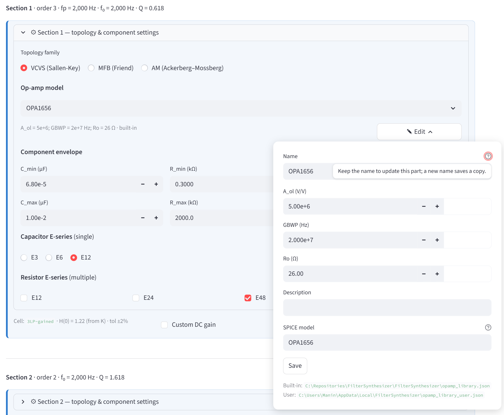

| Control | Key | What it does |
|---|---|---|
| ✎ Edit | — | Beside the caption of a library part. Opens a popover with the part's fields. |
| Name | `hw_oped_name_*_*` | Keep it to update this part; type a new name to save a copy under it. |
| A_ol (V/V), GBWP (Hz), Ro (Ω), Description | `hw_oped_aol_*_*`, `hw_oped_gbwp_*_*`, `hw_oped_ro_*_*`, `hw_oped_desc_*_*` | The part's values. |
| SPICE model | `hw_oped_spice_*_*` | The LTspice model the export uses for this part (§9): the name of an op-amp in the app's LTspice library, e.g. `TL072H`. Empty = the generic model built from A_ol, GBWP and Ro. |
| Save | `hw_oped_save_*` | Writes the part to your user library. Editing a built-in part stores an override; the shipped values are never changed. The section switches to the saved part. |
| Revert to shipped values | `hw_oped_revert_*` | Only for an edited built-in part: removes your override. |
| Delete part | `hw_oped_del_*` | Only for a part of your own: removes it; the section falls back to Ideal. |
| Save as part | `hw_opnew_name_*` | **Custom…** only: a name for the current A_ol, GBWP and Ro. It must not match an existing part (case does not count). |
| Save to library | `hw_opnew_save_*` | Saves that part; the section switches to it. |

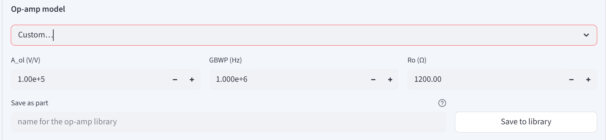

A green or red note under the picker confirms each save, revert or delete for
ten seconds. The popover's last line shows the paths of the built-in and the
user library files. A library change is seen by every section's list at once.
If a library file cannot be read, a yellow warning above the picker says why
and the app carries on with what it could read.

A part that was in an older library and is gone now — TL072, LM358 and NE5532
were replaced by TL072H, LM358B and TLV9001-4 in 1.1.0 — falls back to Ideal.

### 1st-order sections

A real pole that is not absorbed becomes a 1st-order section. Its expander is
shorter, **⚙ Section N — component settings**: the op-amp, **C_max** (the pole
is realized at the three E-series capacitor values nearest below it), and the
two E-series. With the capacitor series on **Custom**, C_max is hidden and the
pole is realized at every value of the custom list instead. The resistor range
is fixed at 100 Ω–10 MΩ. It needs no family and no Solve button: it is solved
in closed form as soon as it appears. In Batch mode it takes the op-amp, C_max
and E-series from the shared box.

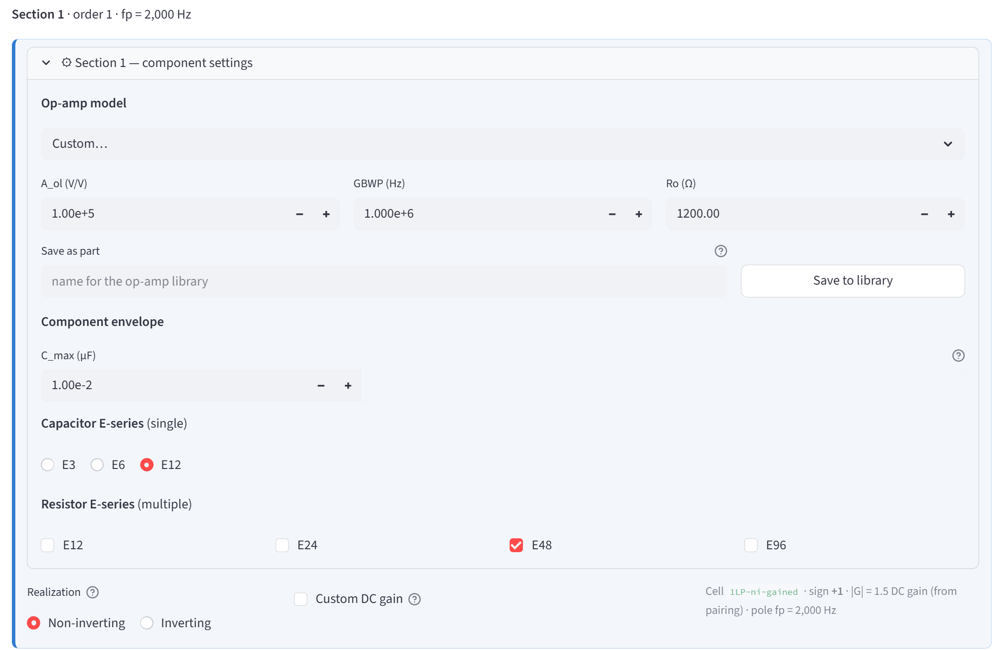

### Per-section gain

| Control | Key | Default | What it does |
|---|---|---|---|
| Custom DC gain / HF gain / DC/HF gain | `hw_dc_chk_*` | off | Off: the section uses the gain Tab 2 gave it. On: type your own. The label follows where the passband is — DC for a low-pass, HF for a high-pass, DC/HF for a pure notch (equal at both ends). Greyed and forced on by **Gained MFB** and **Eliminate R1**. |
| (gain value) | `hw_dc_val_*` | the allocated gain | 2nd/3rd order: at least 0.1. Below 1 selects an attenuating cell where the family has one — a 2nd-order low-pass or any high-pass for VCVS; any section for MFB and AM. Moving gain between sections does not rebalance the others; keep the product equal to the passband gain. |
| Override section Ki value | `hw_ki_chk_*` | off | Band-pass sections, in place of the gain control. The passband of a band-pass is its peak, whose height depends on Q, so the coefficient Kᵢ is set directly; the caption shows the pairing Kᵢ and the resulting \|H(f₀)\|. |
| Ki | `hw_ki_val_*` | the pairing Kᵢ | In rad/s, or (rad/s)² for a band-pass with an absorbed low-pass pole. |
| Realization | `hw_fo_real_*` | Non-inverting | 1st-order sections: non-inverting (sign +1) or inverting (−1). Custom gain is then at least 0.01; non-inverting below 1 is an attenuator. The caption names the cell, e.g. *Cell `1LP-ni-gained` · sign +1*. |

### Near-notch sections

A section whose transmission zero lies close to f₀ — but not on it, as an
Inverse Chebyshev or Elliptic band design can produce — is solved as a
low-pass-notch or high-pass-notch section (LPn / HPn), whose cells place the
zero where it is. Treating it as a pure notch would move the zero onto f₀ and
change the response.

When the zero is within 5 % of f₀, which realization fits better cannot be
told from the mathematics alone, so the section is solved **twice**: on its
LPn/HPn cells and on the family's pure-notch (2N) cells. A caption says so:

> ℹ Near-notch section: f_z is 1.4 % from f₀ (forcing it onto f₀ changes the
> response by up to 3.13× the section gain). Solved on both `2HPn-AM`,
> `2HPn-AM-C1s` and the pure-notch `2N-AM`, `2N-AM-C1s`; the BOMs are ranked
> together by snap cost.

That example is section 4 of an Elliptic bandpass — order 9 per side,
1.9–2.2 kHz, α_max 1 dB, A_s 40 dB — with f₀ = 1910 Hz, Q = 114 and
f_z = 1884 Hz.

Both sets of BOMs are scored against the true target, zero included, and the
table is sorted by **Snap cost** by default: a pure-notch row that cannot
place the zero carries a high snap cost and sinks. One **Solve section** runs
both solves.

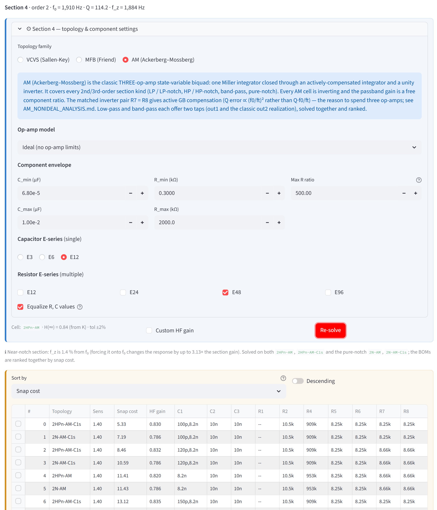

A near-notch needs a component spread of about 1/\|(f_z/f₀)² − 1\| on the VCVS
and MFB cells. When such a section comes back empty, the diagnosis says so and
suggests AM, which sets f_z and f₀ with independent ratios (§6.4).

### Solving and the candidates table

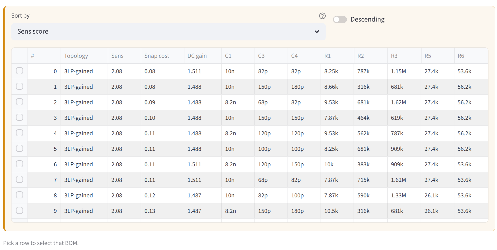

| Control | Key | Default | What it does |
|---|---|---|---|
| Solve section / Re-solve | `hw_solve_*` | — | Starts the solve in the background. Greyed while it runs, and when the chosen family has no cell for this section. Reads **Re-solve** when results for these exact settings exist. |
| Sort by | `hw_sortf_*` | Sens score (Snap cost for a near-notch section) | Sens score, Snap cost, the gain column, or any component column. Sorts by numeric value, so 8.25k comes before 78.7k. |
| Descending | `hw_sortd_*` | off | Reverses the order. |
| The table | `hw_df_*` | no row | Tick the box at the left of a row to pick that BOM. Rows are striped for reading. |
| Select solution # | `hw_pick_*` | 0 | Only on Streamlit versions without row selection: type the row's **#**. |

**Reading a row.** **#** is the row's place after sorting; **Topology** the
cell; **Sens** and **Snap cost** as in §2; the gain column (**DC gain**,
**HF gain**, **DC/HF gain** or **Center gain**) is the passband gain the
snapped parts actually give, op-amp included. Then one column per component
the solved cells use. By default rows are ranked by Sens rounded to two
decimals, with ties broken by the lower snap cost. A capacitor shown as
`1n,2n` is two capacitors in parallel.

**After a pick**, a green box repeats the choice (*Selected #0: `3LP-gained` ·
snap_cost 0.08 · sens 2.08 · DC gain 1.511 V/V*), the BOM is listed —
**Capacitors** as chosen, resistors snapped with the pre-snap ideal value in
grey — and the schematic is drawn with designators prefixed by the section
number (1R1, 1C1 …) and the op-amp's name under U. With a real op-amp, a
caption confirms *BOM checked against exact non-ideal op-amp physics.*

| Control | Key | What it does |
|---|---|---|
| ⬇ SVG | `*_svg_*` | The annotated schematic as a vector file. Here and in Tab 4. |
| ⬇ PNG | `*_png_*` | The same as a bitmap. Only present when PNG export works (§6.8). |

### Overall filter

At the foot of the tab, once every section has a pick: **Overall realized DC
gain** (HF gain for a high-pass) — the product of the sections' realized gains,
signed — and **Overall realized passband gain**, which scales that by the
design's passband-to-DC ratio. A band-pass shows the centre gain, measured on
the realized cascade at the passband peak; a band-reject shows **LF passband
gain** and **HF passband gain** separately. For Custom H(s) the target is the
entered peak gain G. A yellow box warns when the output is inverted (§6.5).

## 3.5 Tab 4 — Resulting Response & Schematic

The cascade rebuilt from the BOMs you picked, top to bottom: the HF warning
(when there is one, §5), **Monte-Carlo tolerances**, the **Bode — design vs
realized** plot, the **Section schematics**, the **LTspice export** and
**Generate Report**. Until every section has a pick the tab shows which
sections are missing, and the report button is greyed (§6.5).

### Monte-Carlo tolerances

The blue box perturbs every resistor and capacitor of the picked BOMs; op-amp
parameters stay fixed.

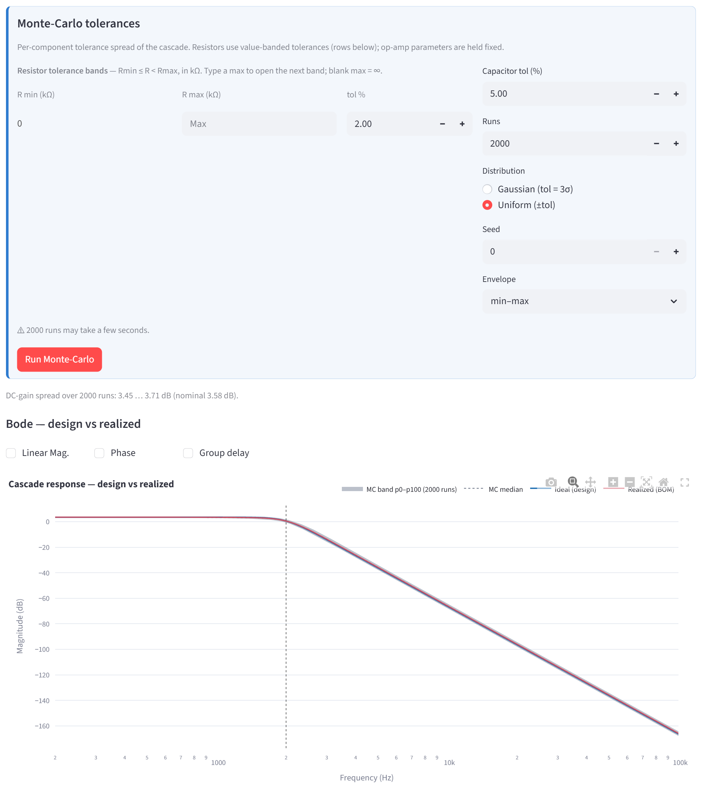

| Control | Key | Default | What it does |
|---|---|---|---|
| R max (kΩ) | `rtol_max_*` | blank = ∞ | Resistor tolerance bands, Rmin ≤ R < Rmax. Typing a maximum opens the next band, which starts there. |
| tol % | `rtol_tol_*` | 1.00 | Tolerance of the resistors in that band. |
| ✕ remove last band | `rtol_rm` | — | Removes the last band. |
| Capacitor tol (%) | `resp_ctol` | 5.00 | Tolerance of every capacitor. |
| Runs | `resp_runs` | 2000 | 10–20000. Above 1000 a caption warns it may take a few seconds. |
| Distribution | `resp_dist` | Gaussian (tol = 3σ) | Gaussian: the tolerance is three standard deviations. Uniform: equally likely anywhere within ±tol. |
| Seed | `resp_seed` | 0 | The same seed and inputs give the same band — reruns are reproducible. |
| Envelope | `resp_envelope` | p1–p99 | Which percentiles the shaded band spans: p1–p99, p5–p95 or min–max. |
| Run Monte-Carlo | `resp_mc_run` | — | Runs it and draws the band; a caption gives the DC-gain spread against the nominal. After any change to the inputs or the picks, a caption asks you to run it again. |

The same tolerances, distribution and runs go into the LTspice Monte-Carlo
file (§9) and, when it is ticked, the report.

### Bode — design vs realized

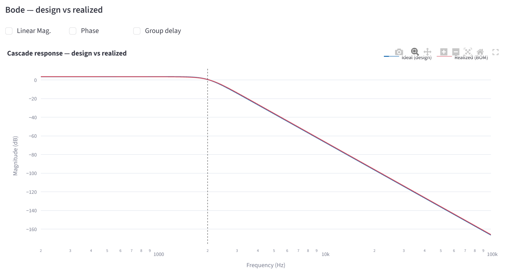

| Control | Key | Default | What it does |
|---|---|---|---|
| Linear Mag. | `resp_show_linear` | off | Linear magnitude axis. |
| Phase | `resp_show_phase` | off | Adds the phase. |
| Group delay | `resp_show_gd` | off | Adds the group delay, design and realized. |

The plot draws Ideal (design) in blue, Realized (BOM) in red, the Monte-Carlo
band in grey with its median dashed, and a vertical line at each section's f₀
(and f_z). The realized curve is the product of the sections computed one by
one, each with its op-amp model; the loading of one section by the next is not
included — the LTspice export simulates it (§9).

**Section schematics**, a collapsed expander below the plot, stacks every
section's schematic in cascade order with its own **⬇ SVG** / **⬇ PNG**
buttons — the same drawings as in Tab 3.

### LTspice export

The block before the report writes the whole cascade as LTspice schematics and
netlists, nominal and Monte-Carlo, in one zip. Chapter 9 covers it, with the
vendor model import.

### Report options

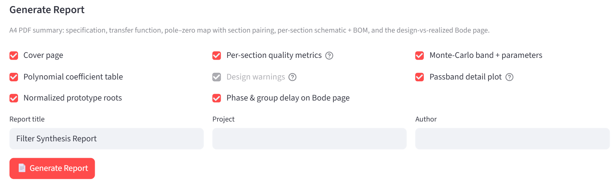

| Control | Key | Default | What it does |
|---|---|---|---|
| Cover page | `rep2_cover` | on | A title page. The three boxes below appear only while it is ticked; unticked, the report uses the default title. |
| Report title | `rep2_title` | Filter Synthesis Report | Heading of page 1 and every footer. |
| Project | `rep2_project` | blank | Big title on the cover (blank: *Active Filter Design*). |
| Author | `rep2_author` | blank | On the cover. |
| Polynomial coefficient table | `rep2_coeff` | on | Report §2a/2b. |
| Normalized prototype roots | `rep2_norm` | on | Report §4a. |
| Per-section quality metrics | `rep2_metrics` | on | Sensitivity, snap cost, realized against target gain, per section. |
| Design warnings | `rep2_warn` | on | Carries the HF-resonance notes (§5) into the report, §8. Greyed when none were raised. |
| Phase & group delay on Bode page | `rep2_phgd` | on | Adds them to report §6. |
| Monte-Carlo band + parameters | `rep2_mc` | on | The band, its settings and the passband-gain spread. If Monte-Carlo has not run with the current inputs, generating runs it once — a caption says so. |
| Passband detail plot | `rep2_zoom` | on | Report §7: the band of interest only. **Stopband detail** for a band-reject. |
| 📄 Generate Report | `report_btn` | — | Builds the PDF. Greyed variants: `report_btn_blocked` (a section has no pick), `report_btn_nodata` and `report_btn_nobackend` (§6.5). |
| ⬇ Download PDF | `report_dl` | — | Saves *FilterReport_&lt;Response&gt;_&lt;Type&gt;_n&lt;order&gt;_&lt;date&gt;_&lt;time&gt;.pdf* — *FilterReport_Custom_&lt;Type&gt;_n&lt;poles&gt;_…* for Custom H(s). Change anything afterwards and a caption says the PDF is out of date. |

# 4. Choosing a topology family

Each section chooses its own family, so one cascade can mix them.

| | VCVS (Sallen-Key) | MFB (Friend) | AM (Ackerberg–Mossberg) |
|---|---|---|---|
| Op-amps per section | 1 | 1 | 3 |
| Polarity | Non-inverting; the pure notch inverts | Inverting; the notch cells do not | Inverting |
| Low-pass, high-pass, with or without notch | Yes | Yes | Yes |
| 2nd-order band-pass, pure notch | Yes | Yes | Yes |
| 3rd-order band-pass (absorbed real pole) | No | Yes — the default for these sections | No |
| Near-notch section (zero just off f₀) | Needs a spread of ~1/\|(f_z/f₀)² − 1\| | Same as VCVS | No such limit |
| Section gain below 1 | 2nd-order low-pass; any high-pass | Any section | Any section |
| Strength | Fewest parts | Covers every section kind; gain is a free ratio | Q barely moves with op-amp bandwidth |
| Cost | Q sensitivity grows with Q | Inverts; Q-enhanced twins trade sensitivity for spread | Three op-amps; needs a low-output-resistance op-amp |

**MFB** solves each cell together with its Q-enhanced (`-QE`) positive-feedback
twin and ranks them; the plain cell usually wins where Q is modest. **AM** gets
its accuracy from the matched pair R7 = R8, which compensates the op-amp's
finite bandwidth: its Q error grows with (f₀/f_t)² instead of Q·f₀/f_t.

Rules of thumb:

- **Start with VCVS.** It is the cheapest realization of low-pass and
  high-pass sections.
- **A 3rd-order band-pass section needs MFB.** The app starts such a section
  on MFB; if you prefer VCVS or AM, untick absorption in Tab 2 so the real pole
  becomes its own 1st-order section.
- **A near-notch section that returns nothing wants AM.** A zero 1–5 % from f₀
  costs VCVS and MFB a large component spread (§3.4).
- **A section with Q below 0.5** comes from two real poles paired into one
  2nd-order section (a wide band-pass or band-reject produces them). It is
  realized like any other 2nd-order section; VCVS handles it well.
- **A section gain below 1** on a 3rd-order low-pass needs MFB or AM, or move
  that gain to another section in Tab 2.
- **A real op-amp drags the realized curve away near a high-Q f₀:** try AM
  with a low-Rₒ op-amp.
- **Polarity matters:** count the inverting sections; the Overall filter
  readout warns when the total is odd.
- **No BOM at all:** before changing family, read the diagnosis (§6.4) — it
  often says the family is fine and the envelope is not.

# 5. Op-amps and what they do to the design

The op-amp is chosen per section, because a high-Q or high-gain section
demands more bandwidth than the others — or once for all sections in Batch
mode (§3.4).

The shipped library, in the order of the list. The values are typical
datasheet figures; check the datasheet for your supply and load, and adjust a
part with **✎ Edit** (§3.4) — your edit is stored as an override.

| Library entry | A_ol (V/V) | GBWP | Rₒ |
|---|---|---|---|
| Ideal (no op-amp limits) | ∞ | ∞ | 0 |
| AD8505 / AD8506 / AD8508 | 1·10⁵ | 95 kHz | 1 kΩ |
| LMV358A | 1·10⁵ | 1 MHz | 1.2 kΩ |
| MAX9636 / MAX9637 / MAX9638 | 1·10⁵ | 1.5 MHz | 100 Ω |
| MAX40100 | 1.41·10⁶ | 1.5 MHz | 100 Ω |
| TL072H | 5.6·10⁵ | 5.25 MHz | 125 Ω |
| LM358B | 1.4·10⁵ | 1.2 MHz | 300 Ω |
| OPA1656 | 5·10⁶ | 20 MHz | 26 Ω |
| TLV9001 / TLV9002 / TLV9004 | 1·10⁵ | 1 MHz | 1.2 kΩ |
| Custom… | your values | your values | your values |

Your own parts follow the shipped ones in the list. Each part also names the
SPICE model the LTspice export uses for it (§9).

- **A_ol** — finite DC gain: small gain and Q errors.
- **GBWP** — the op-amp's gain falls with frequency. This shifts f₀ and
  raises Q, more so for high-Q, high-gain sections and as f₀ approaches the
  GBWP.
- **Rₒ** — output resistance works against the feedback network and shows up
  far above the passband, as a rise of the realized response.

With a real op-amp the solver pre-distorts the ideal solution so that the
section lands on target *with* that op-amp, then snaps and checks the BOM
against the exact non-ideal model. Tab 4's realized curve and the report use
the same model; Monte-Carlo holds it fixed. The part number (or the Custom
parameters) is printed under the op-amp in the schematic.

**The HF resonance warning.** Tab 4 compares realized with design from the
highest corner up to 100 times it. When red rises at least 1 dB above blue, a
yellow box appears:

> [!warning] ⚠ HF resonance (~N dB at F) — over [range] the realized (red)
> response peaks ~N dB above the design (blue). This is the
> Ackerberg–Mossberg finite-Rₒ loop resonance from the op-amp output impedance
> (AM section …), not a synthesis error.

Without AM sections it reads **⚠ HF rise** and blames the output impedance
alone. It is physics, not a solver fault. Fix it with an op-amp of lower
output resistance (about 50 Ω or less), or with MFB for the sections it names.

# 6. When it goes wrong

Messages are quoted as the app prints them; "…" marks the parts that vary.

## 6.1 Specification and approximation

| The app says | What it means | What to do |
|---|---|---|
| Mathematical Constraint Violation: Band-Reject filters require an EVEN total order. Your current total is N. | Asymmetric band-reject with LP + HP odd. | Change one of the two orders by one. |
| Mathematical Constraint Violation: Asymmetric Elliptic Band-Reject requires … | Asymmetric elliptic band-reject needs even orders that differ by at most 2. | Adjust the orders. |
| ⚠️ Max total order for Asymmetric Elliptic is 15. Extreme orders may cause calculation delays. | A warning, not a block. | Lower LP + HP, or be patient. |
| Engine Error: … | The approximation engine failed for this specification. | Change the specification slightly (order, corners, A_s). If it persists, report it (§6.7). |
| Stopband Attenuation does not meet the requirements (Asymptote exceeds limit) | The stopband never reaches A_s — typically after pinning notches. | Unpin or move notches, raise the order, or lower A_s. |
| Calculated Stopband Edge (f_s): … (Extended due to manual notch placement) | A pinned notch pushed the stopband edge out. | Informational. Move the notch if f_s matters. |
| Order is too low to support finite transmission zeros. | No notch rows at this order. | — |
| Manual Notch Tuning … is disabled … | Elliptic band filters, and Elliptic above order 8. | By design. |

### Bessel and Equiripple Delay

| The app says | What it means | What to do |
|---|---|---|
| **n = N** — no order ≤ M meets the spec; this is the closest (yellow box, ✗ lines) | No allowed order meets the order criterion; the design uses the closest one. | Relax the criterion — a longer τ₀ budget, a lower f_d, a looser ε or δ, a lower A_s or a higher f_s — or accept the closest order. |
| Tick at least one order criterion. Using n = N meanwhile. / Order selection failed: … Using n = N meanwhile. | No order could be selected; the design keeps the last manual order. | Fill in the criterion's value; report a failure (§6.7). |
| Stopband criterion ignored: f_s must lie outside f1…f2. | Bandpass: the stopband frequency is inside the passband. | Move f_s below f1 or above f2. |
| Band too wide for the delay-preserving bandpass: B/f0 = … exceeds … for n = N; the translated poles would cross the real axis. | The delay-preserving mapping works up to a fractional bandwidth that falls with the order. | Narrow the band, lower the order, or choose **Classic (geometric)**. |
| Equiripple Magnitude Stopband: needs manual order and the corner anchor. | The equiripple stopband places notches around a fixed corner and order. | Order selection **Manual** and Specify by **Corner frequency**. |
| Equiripple stopband: the notch solve did not converge (humps within … dB of −A_s). | The notches were placed, but not all humps reached −A_s exactly (the readout turns yellow). | Use fewer active notches, or a lower A_s. |
| Notches at or inside the passband were ignored: they cannot keep the delay flat (a passband notch adds a delay bump of area π). | A pinned notch below the corner. | Pin it above the corner. |
| The corner cannot be held at f_c: the notches are too close to it (…). Poles left unscaled; the corner moves down. | The notches pull the response down at the corner more than α allows. | Move the notches away from the corner. |
| Manual notches are not available for … bandpass filters. | By design. | — |

### Custom H(s)

A refused H(s) shows a red box under the panel — **This H(s) cannot be used:**
— followed by one line per reason. The design stops there; fix the entry and
it continues.

| The line says | What it means | What to do |
|---|---|---|
| '…' is not a number. / Coefficients must be finite. / … must be a nonzero number. | A cell or constant cannot be read. | Correct the cell. Typed text is kept as typed, so a stray character shows. |
| The numerator / denominator is empty or all zero. / The denominator has no s terms: no poles. / H(s) has no poles. | Not a filter yet. | Fill in the denominator. |
| Pole pair N: f₀ must be > 0. / Pole pair N: Q is needed … / Row N: a and b are both 0. / Row N: a = 0 puts the poles on the jω axis. | A row of a factored form is incomplete or puts poles on the jω axis. | Complete or correct the row. |
| …: lone complex root … (no conjugate). | A complex root was entered without its conjugate. | In the Roots form enter Im ≥ 0 only — ω > 0 stands for the pair. |
| N pole(s) at the origin / on the jω axis (Q = ∞) / in the right half-plane … | The filter would not be stable. | Check signs: poles need a negative real part. |
| Real LHP zero(s) at … / Off-axis LHP zero pair(s) at … / Real RHP zero(s) … / RHP zero pair(s) … | Only zeros at the origin, on the jω axis or at infinity are realizable today; no cell has a real or off-axis zero. | Remove those zeros. An all-pass or equalizer H(s) cannot be built yet. |
| Improper H(s): N finite zeros > M poles … / Improper prototype … | More zeros than poles. | Check the numerator degree. |
| N poles exceed the limit of 30. / Prototype order N exceeds the limit of M for … | Above the order limits (§3.1). | Lower the order. |
| N jω zero pairs but only M complex pole pairs … | Each notch needs a complex pole pair to sit on. | Check the zeros, or the poles. |
| A lowpass prototype has no zeros at the origin. | Prototype mode with an origin zero. | Use **Complete H(s)** for a high-pass or band-pass you already have. |
| \|H(j1)\| is … dB below the prototype's peak: ω = 1 must be its passband edge (check the table's normalization). | Prototype mode: the entered prototype's edge is not at ω = 1 (more than 40 dB down there). | Rescale the prototype, or use Complete H(s) with the table's f_n. |
| The prototype needs a corner frequency > 0. / The prototype needs 0 < f1 < f2. | Sidebar corners. | Correct them. |
| The response is not recognised as a lowpass, highpass, bandpass or band-reject at α = … dB … Change α or H(s). | Complete mode: the type could not be detected at that edge level. | Change **Passband edge level α**, or check H(s). |

Yellow warnings under the diagnostics do not stop the design:

| The app says | What it means |
|---|---|
| K < 0 is used as \|K\| … | The sign is set by the circuits, not by H(s). |
| N cluster(s) of repeated roots merged at the typed precision … | Nearly equal roots were treated as one repeated root; enter them factored or as roots for exact multiplicity. |
| Coefficient conditioning: the typed precision leaves … dB of passband uncertainty … | A high-order polynomial typed with few digits; enter it factored or as roots. |
| \|H(j1)\| is … dB below the peak: ω = 1 is not the prototype's passband edge … / The prototype does not look like a lowpass (detected: …). | Prototype mode: check the table's normalization. |
| Detected type: …, but the Filter Type radio says … | Prototype mode: the mapped result is not what the radio says; the radio's type is used. |
| Entered peak gain G = … V/V < 1: an attenuating passband … | Some VCVS sections may be unsolvable (a 3rd-order VCVS low-pass cannot go below 1); MFB and AM still work. |
| **Pairing pre-flight:** … stage N (order …) gets … / has a numerator no cell realizes … | The automatic pairing would give a section something no circuit realizes. Re-pair the stages named by hand in Tab 2. |

## 6.2 Pairing

| The app says | What it means | What to do |
|---|---|---|
| ⚠️ Pairing Incomplete: There are floating zeros on the board (drawn in gray). Please assign them to a stage. | A manual edit left zeros without a section; nothing is handed to the Topology tab. | Click a pole, then the grey zero — or press 🔄 Auto-Pair (Reset). |
| ⚠️ Please click a Pole first to initiate routing. | A zero was clicked first. | Click a pole, then the zero. |
| 🚫 Cannot merge poles: 'Enable 3rd-Order Sections' is unchecked. | Absorbing a real pole needs the checkbox. | Tick it. |
| ⚠️ Manual Override Active: Background auto-router is currently bypassed. | Your edits are in charge. | 🔄 Auto-Pair (Reset) to go back. |

## 6.3 Topology, before and during a solve

| The app says | What it means | What to do |
|---|---|---|
| Finalize the cascade in Biquad Pairing & Cascading first — each section will appear here for hardware synthesis. | No cascade yet. | Complete the pairing in Tab 2 (§6.2), or fix the specification. |
| ⏳ … section (family …) — solver not yet available; gated to avoid mis-solving on a mismatched cell. | No solver exists for this kind of section yet. | Re-pair so the section becomes a supported kind — e.g. untick absorption. |
| Section N is a 3rd-order band-pass … Switch this section to MFB (Friend) … | VCVS and AM cannot place the third pole of a band-pass. Solve is greyed. Such a section starts on MFB; the message appears when you switch it away. | Family → MFB, or give the real pole its own section. |
| No R series selected — defaulting to E48. | No resistor series ticked. | Tick at least one. |
| not a capacitor value: … (use a p / n / u suffix …) — still using the previous list. Also: enter at least 2 different values; the values must span at least 1.5×. | The *Custom capacitor values* entry cannot be used. The sections keep the last valid list. | Fix the entry as the message says. |
| ⚙️ Solving… (other sections and tabs stay responsive) | Normal. | Keep working elsewhere. |
| ⏳ Queued — waiting for a free core (other sections and tabs stay responsive) | More sections are solving than there are free cores (§1). | Wait; it starts when a core is free. |
| ℹ Near-notch section: f_z is …% from f₀ … Solved on both … and the pure-notch …; the BOMs are ranked together by snap cost. | Informational (§3.4). | — |
| ⚠ The `…` solve failed: … | A near-notch section: one of its two solves failed; the table shows the other's BOMs. | Usable as is; report the failure (§6.7). |
| Op-amp library: … could not be read (…); ignored. / … duplicate key … / … entry skipped — … / '…' is a reserved name; entry skipped. | A library file — usually your own, edited by hand — has an error. The yellow box above the picker names it; the rest of the library works. | Fix or delete the entry in the file the message names (§7.4). |
| Enter a name. / '…' conflicts with existing part '…'. / '…' is reserved. / Name is longer than … characters. | Saving an op-amp part: the name is empty, taken (case does not count), or reserved (*Ideal*, *Custom*). | Choose another name. |
| Could not save: … / Could not update the library: … | The user library file cannot be written. | Check that `%LOCALAPPDATA%\FilterSynthesizer` is writable. |

## 6.4 A solve that returns nothing

When a solve finds no BOM, the app runs a quick idealized check of what the
section would need and replaces the generic message with a diagnosis. The
diagnosis can take up to half a minute after the solve ends.

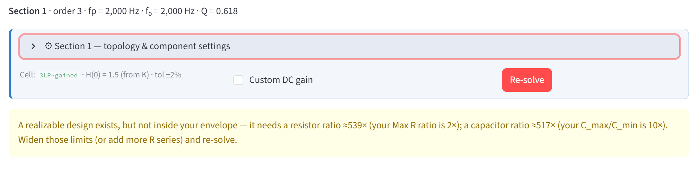

| The app says | What it means | What to do |
|---|---|---|
| No realization inside the component envelope. Widen R/C limits, relax Max R ratio, add more R series, or raise thoroughness. | Nothing found, and the check reached no verdict. | In that order. |
| A realizable design exists, but not inside your envelope — it needs a resistor ratio ≈N× (your Max R ratio is M×); a capacitor ratio ≈…× (your C_max/C_min is …×). … | The design needs a wider spread than you allow; each part names the limit that stops it. | Raise Max R ratio above N; widen C_min…C_max beyond the capacitor ratio named. |
| A realizable design exists inside your envelope (it needs only …), but the search didn't reach it. … | The limits are fine; the search missed it. | Search thoroughness → Thorough and re-solve, or nudge the section gain slightly. |
| A realizable design almost certainly exists at this gain (…), but the search didn't find one in your envelope. … | The same, found by a gain-band check. | The same. |
| No realizable solution at this gain. You asked for X, but the nearest gain this topology can realize for the target shape is ≈Y. … | This family cannot make this gain with this f₀ and Q (and f_z). | Set the section gain to about Y with Custom gain and move the difference to another section, or change the family. |
| No realizable solution exists for these targets — the pole/zero shape itself isn't achievable with this topology. Choose another topology. | Structural. | Change the family (§4). |
| Near-notch section: the zero is …% from f₀, and VCVS / MFB notch cells need a component spread of about 1/\|(f_z/f₀)² − 1\| ≈ N× to place it. The AM (Ackerberg–Mossberg) family realizes it without that spread. | Shown above the diagnosis for a near-notch section on VCVS or MFB. | Family → AM, or raise Max R ratio and widen C_min…C_max beyond N×. |
| No realization fits the constraints — raise C_max, add a resistor E-series, or (ni-gained) relax the gain so R3+R4 lands in 5k–50k. | A 1st-order section found no parts. | As it says. |

## 6.5 Results and the report

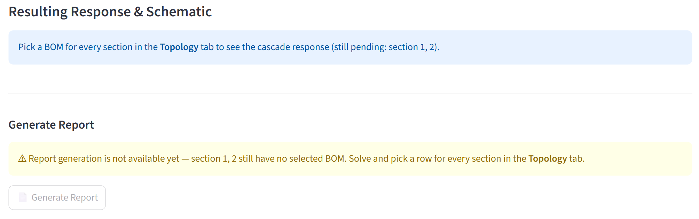

| The app says | What it means | What to do |
|---|---|---|
| Select a solution for every section to see the overall gain (still pending: section N). | Tab 3's Overall filter waits for picks. | Tick a row in each section listed. |
| ⚠ Output is inverted — an odd number of inverting (inv) stages gives overall sign −1. … | The cascade inverts. | Make the count of inverting sections even (family or Realization), or add an inverter. |
| Finalize the cascade and synthesize sections in the Topology tab first — this view combines the selected per-section BOMs. | No cascade yet. | Tabs 3 and 4 first. |
| Pick a BOM for every section in the Topology tab to see the cascade response (still pending: section N). | Solved is not picked. | Tick a row in each section listed. |
| ⚠ Report generation is not available yet — section N still has no selected BOM. … | The same gate, for the report. | The same. |
| Section N: can't build response for `cell` (…). | The response model of that cell failed. | Pick another row; report it (§6.7). |
| ⚠ HF resonance (~N dB at F) … / ⚠ HF rise (~N dB at F) … | Op-amp output resistance (§5). | A lower-Rₒ op-amp, or MFB for the AM sections named. |
| Inputs changed since the last run — click Run Monte-Carlo to refresh the band. | The band on screen is stale. | Run Monte-Carlo again. |
| Monte-Carlo failed: … | | Report it. |
| Monte-Carlo has not been run (or its inputs changed). Generating the report will run it once with the settings above — this adds a few seconds. | Informational. | — |
| Settings changed since this PDF was built — press Generate Report again to refresh it. | The download button still offers the older PDF. | Generate again. |
| Report generation failed: … | | Report it. |
| PDF report support needs the `reportlab` package, which is not installed in this environment. | Optional packages missing (source install). | `pip install reportlab matplotlib cairosvg` |
| Report data is not being published by `app.py` — missing … | The installation is incomplete or modified. | Reinstall. |
| ⚠ Schematic SVG not found … expected `…` in `…`. | The drawing for that cell is missing. | Restore the Section_Schematic_Diagrams folder (§7.4). |

## 6.6 Errors with a Details box

**Engine Error: …** (under the title) and **Solver error: …** (in a section)
each come with a collapsed **Details (paste this into a bug report)** box
holding the technical trace. The first is the approximation engine, the
second the hardware solver. Neither is your fault; report both (§6.7).

## 6.7 Reporting a problem

Include:

- the app version from the title line (*Filter Synthesizer v1.1.0 - …*);
- the specification — the sidebar, or page 2 of a PDF report;
- the section's header line (order, fp, f₀, Q, f_z) and a screenshot of its
  open settings expander;
- the text of the **Details** box, when there is one;
- for an LTspice problem, the README.txt of the export zip (it lists every
  section's cell, model and warnings) — but not the vendor model files;
- for the packaged app, the output of `FilterSynthesizer.exe --selftest`,
  which writes a diagnostic report without starting the app.

A maintainer may ask you to start the app with the environment variable
`FILTERSYNTHESIZER_DEBUG=1`; each section then shows a **🔧 exact solver call**
panel whose contents belong in the report.

## 6.8 No ⬇ PNG button next to ⬇ SVG

The PNG button appears only when the `cairosvg` package can render — it is a
live indicator. Without it you lose the PNG downloads, and the report's
schematic pages print a placeholder; everything else works. From source:
`pip install cairosvg` (on Windows it also needs the Cairo library). In the
packaged app, use the SVG.

## 6.9 LTspice export

| The app says | What it means | What to do |
|---|---|---|
| … (section N): its vendor model is not imported yet, so it uses FS generic with the library's A_ol / GBWP / Ro. Download the model from … and import it under Vendor model files. | The part needs a vendor model you have not imported (§9.3). The zip still works, with the generic model. | Import the model, or leave it if the generic model is enough. |
| Section N: SPICE model '…' is not in the op-amp model library / fails the dummy check (…) -- FS generic used | The part's **SPICE model** field names a model the export cannot use. | Correct the field in **✎ Edit** (§3.4), or clear it to use the generic model on purpose. |
| Section N: Vs = … V is outside …'s supply range … V | The supply does not suit the real model. | Change **Supply Vs**. |
| Section N (…): no DC path at … -- a real op-amp model will not bias there | That node floats at DC (the **DC path** column says the same). Harmless with the generic model. | With a real model, expect LTspice to fail the operating point there; pick another row or family. |
| Schematic (.asc) not written -- the drawing failed its self-check … | The .asc schematics were left out so that no wrong drawing ships; the netlists (.cir) are complete. | Simulate the .cir files; report it (§6.7). |
| Section N: template … rejected: … | A cell template could not be used; the section is auto-laid-out instead. | Nothing — it simulates the same. |
| Op-amp library: … | An op-amp model file in your library has an error (the **Op-amp model library** expander shows which). | Fix or remove the file named. |
| LTspice export failed: … | The export could not be built; the rest of the tab is unaffected. | Report it (§6.7). |

Importing a vendor model (§9.3):

| The app says | What it means | What to do |
|---|---|---|
| …: not a readable zip file / the zip holds no … / expected one of … | The file chosen is not the vendor's model or zip for this part. | Download the PSpice model from the product page again; pick the zip itself. |
| …: file larger than … MB | Not a model file. | Pick the model file or its zip. |
| no SPICE .subckt model found | The file holds no subcircuit. | Pick the model file (.lib, .txt, .mod, .cir …), not a document. |
| **Pin roles could not be read from the model** — set each from the vendor's pinout note … | The pin names did not say which pin is which. | Set each pin from the comment above the model's `.subckt` line. |
| give each of the 5 pins a different role (in+, in-, V+, V-, out) | Two pins have the same role. | Correct the pin roles. |
| installed — not bundled (no consent recorded) | A model file placed in the models folder by hand. | Press **I accept the vendor's terms for …** to have it bundled. |
| Could not record the consent: … | The models folder is not writable. | Check `%LOCALAPPDATA%\FilterSynthesizer\LTspice_Library`. |

# 7. Reference tables

## 7.1 E-series

| Series | Values per decade | Usual tolerance class | Offered for |
|---|---|---|---|
| E3 | 3 | wider than ±20 % | capacitors |
| E6 | 6 | ±20 % | capacitors |
| E12 | 12 | ±10 % | capacitors, resistors |
| E24 | 24 | ±5 % | resistors |
| E48 | 48 | ±2 % | resistors |
| E96 | 96 | ±1 % | resistors |

The series decides which values the solver may use. The tolerance of the parts
you actually buy goes into Tab 4's Monte-Carlo.

## 7.2 Defaults

| Setting | Default | In real parts |
|---|---|---|
| C_min … C_max | 6.80e-05 … 1.00e-02 µF | 68 pF … 10 nF |
| R_min … R_max | 0.3 … 2000 kΩ | 300 Ω … 2 MΩ |
| Max R ratio | 500 | |
| Capacitor / resistor series | E12 / E48 | |
| Family / op-amp | VCVS / Ideal (MFB for a 3rd-order band-pass section) | |
| Batch mode | off | |
| Monte-Carlo | R 1 %, C 5 %, Gaussian, 2000 runs, seed 0, p1–p99 | |
| LTspice export | Vs 5 V (±2.5 V), MC runs = Monte-Carlo runs, vendor models used where imported | |

## 7.3 Reading a cell name

| Part | Means | Examples |
|---|---|---|
| Leading digit | Section order | `2LP-unity`, `3LP-gained` |
| LP, HP, BP, N | Low-pass, high-pass, band-pass, pure notch | `2HP-gained`, `2BP`, `2N` |
| n after LP or HP | With a notch (a zero pair) | `2LPn-unity`, `3HPn-MFB` |
| 2BP1LP, 2BP1HP | Band-pass pair plus an absorbed low- or high-pass pole: a 3rd-order band-pass | `2BP1HP-MFB` |
| -unity, -gained, -atten | VCVS gain variant: = 1, > 1, < 1 | `2LP-atten` |
| -MFB, -AM | Family; no suffix means VCVS | `2LP-MFB`, `3LP-AM` |
| -MFB2, -AM2 | The family's second realization: MFB2 the unity/gained HP-notch, AM2 the alternative output tap | `2HPn-MFB2`, `2LP-AM2` |
| -QE | Q-enhanced twin (positive feedback) | `2BP-MFB-QE` |
| -LS | Lower-sensitivity branch | `2LPn-MFB-LS` |
| +R1, +R7, +R8 | Twin with one extra resistor | `2LPn-MFB-LS+R7` |
| -C1s | Input capacitor split into a parallel pair | `2HP-AM-C1s` |
| 1LP-ni, 1LP-inv | 1st order, non-inverting / inverting, then the gain variant | `1LP-ni-gained` |

## 7.4 Files and folders

| Where | What |
|---|---|
| The folder holding FilterSynthesizer.exe | `_internal` (must stay next to the EXE); `Section_Schematic_Diagrams` — the schematic drawings, one `.drawio.svg` per cell, used without a rebuild when one is dropped there; `opamp_library.json` — the shipped op-amp library (§5); `LTspice_Library` — the shipped LTspice op-amp models, cell templates and symbols (§9); and the two PDF guides. Running from source, the same files sit in the app folder. |
| `%LOCALAPPDATA%\FilterSynthesizer` (Windows); `$XDG_DATA_HOME/FilterSynthesizer` or `~/.local/share/FilterSynthesizer` (Linux) | The symbolic transfer-function cache and logs — safe to delete; the next start is slow again (10–20 s instead of 2–4 s). Running from source, the cache sits in the app folder. **Your own files, kept across upgrades:** `opamp_library_user.json`, your op-amp parts and edits (§3.4); `LTspice_Library\models`, the vendor models you imported, their `FS_<PART>.lib` wrappers and `consent.json`, the record of your consent (§9.3); `LTspice_Library\opamps` and `\cells`, your own op-amp models and cell templates, which override shipped ones of the same name. Delete these only if you mean to lose them. |
| Your browser's download folder | Reports, LTspice zips, SVG and PNG schematics. |

## 7.5 Optional packages

| Package | Without it |
|---|---|
| reportlab, matplotlib | No PDF report. The report block names the missing package and the pip line. |
| cairosvg | No ⬇ PNG schematics; the report's schematic pages print a placeholder. |

All three are in `requirements.txt`; the usual casualty is cairosvg, which
needs the Cairo library on Windows.

# 8. What the PDF report contains

A4, the plot pages in landscape. Every page carries a footer: report title ·
date and time · design hash · page. The design hash identifies the cascade —
two reports with the same hash describe the same sections and gains.

| Part | Contents | Controlled by |
|---|---|---|
| Cover | Project (or *Active Filter Design*), the subtitle *Response Type · order N · corner*, author, date, app version | Cover page |
| 1 · Design specification | Every sidebar value, and the calculated stopband edge(s). Bessel and Equiripple Delay add the delay specification — delay anchor, bandpass mapping, ripple δ, τ(0) or the delay at the centre, the flat-delay band, the peak-to-peak delay, the highest section Q, and how the order was chosen. Custom H(s) lists the mode, the entry form and scale, the structure (poles and zeros), the edges, the gain mode and the entered peak gain G instead of an order and corner; it has no modification or manual-notch rows. With the equiripple stopband, *Manual notches* lists the solved notches and the pole scale | always |
| 2 · Transfer function | H(s), denormalized in rad/s, with the gain constant K; 2a monic coefficients; 2b coefficients with K folded into the numerator | 2a/2b: Polynomial coefficient table |
| 3 · Pole–zero map — section pairing | Each section's roots in its colour; dashed links pair poles with zeros; dotted circles mark each section's ω₀ | always |
| 4 · Root locations | Poles and zeros in rad/s with their section; 4a the normalized roots | 4a: Normalized prototype roots |
| 5.N · Section N — cell | Design parameters (order, f₀, ω₀, Q, f_z, f_p, Kᵢ, Peak \|H\|); schematic; BOM with the pre-snap ideal in brackets; op-amp; solver constraints; quality metrics; the section's H(s) | Quality metrics: Per-section quality metrics |
| 6 · Bode — design vs realized | Cascade magnitude with the Monte-Carlo band and its parameters; the passband-gain table | Phase & group delay on Bode page; Monte-Carlo band + parameters |
| 7 · Passband detail | Design vs realized over the band of interest, same shading (*Stopband detail* for a band-reject) | Passband detail plot |
| 8 · Design notes & warnings | The HF-resonance notes, when any were raised | Design warnings |

**Gain error in the quality metrics.** With a single section it is measured
against the specified filter gain. In a cascade each section carries only its
share, so it is measured against that section's own design target. *DC gain
(design)* is evaluated at the section's passband reference — f₀ for a
band-pass, DC for a low-pass, HF for a high-pass; on a 3rd-order section the
absorbed pole tilts the response, so it sits slightly below Peak \|H\|. *DC
gain (realized)* uses the snapped values at zero tolerance.

**Passband gain in §6** is the top of the passband ripple — the highest
magnitude inside the band — found separately for the design, the realized
curve and every Monte-Carlo run. It is not the DC gain: for an even-order
Chebyshev or Elliptic without the even-order modification, DC sits a full
ripple lower. This is also why the report's spread can exceed the DC-gain
spread shown in Tab 4. In the Quick Start example the screen gives 3.45 …
3.71 dB at DC, yet with **Linear Mag.** ticked the band rises to about 1.6 V/V
(+4.1 dB) just below the 2 kHz corner: tolerances raise a peak there, and the
report's passband table, which takes each run's highest point, shows that
wider spread.

# 9. LTspice export

The **LTspice export** block, in Tab 4 just above Generate Report, writes the
whole cascade as an LTspice 24 simulation: the sections in series, exactly as
picked, with each op-amp's SPICE model. It is the check the app cannot do
itself — LTspice simulates the loading of each section by the next, and a real
op-amp model adds what the app's linear model leaves out: rails, offsets and
the part's own frequency behaviour.

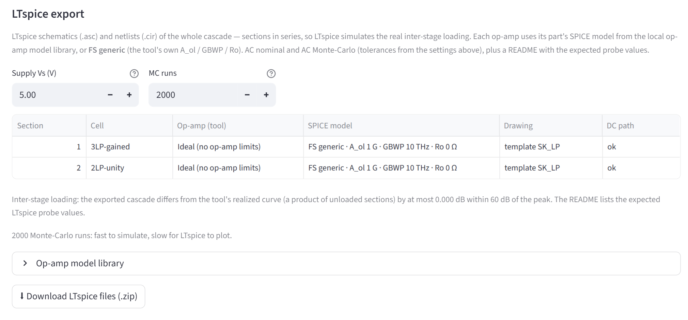

## 9.1 Controls and what the table says

| Control | Key | Default | What it does |
|---|---|---|---|
| Supply Vs (V) | `spice_vs` | 5 | Written as two Vs/2 sources with ground at the midpoint, ±2.5 V by default. The generic model is linear, so Vs matters only for real op-amp models; a Vs outside a part's supply range raises a warning. |
| MC runs | `spice_mc_runs` | the **Runs** above | Runs in the Monte-Carlo file, 1–20000. LTspice simulates thousands quickly but plots them slowly. |
| Export … with simplified generic models | `spice_generic_vendor` | off | Shown when a section uses a part with a vendor model (§9.3). On: those sections use the generic model with the library's A_ol, GBWP and Ro. Off: the vendor model, where you have imported it. |
| ⬇ Download LTspice files (.zip) | `spice_dl` | — | The zip, *FS_LTspice_&lt;design&gt;_&lt;date&gt;_&lt;time&gt;.zip*. It is rebuilt on every change, so there is no separate Generate step. |
| Section N SPICE model | `spice_opamp_*` | Auto | Diagnostic only, shown when the app runs with `FILTERSYNTHESIZER_DEBUG=1`: overrides a section's model. |

One row per section:

| Column | Shows |
|---|---|
| Section, Cell | The section and its picked cell. |
| Op-amp (tool) | The op-amp chosen in Tab 3. |
| SPICE model | The model the export uses: the part's model, or *FS generic · A_ol … · GBWP … · Ro …* — prefixed *Simplified* when the checkbox above is on, or *Model not imported* when the part's vendor model is missing. |
| Drawing | How the section is drawn in the .asc schematic: *template …* (a hand-drawn cell template) or *auto-layout* (op-amps, a row of resistors and a row of capacitors, every pin on a labelled net) — with the reason when a template was rejected. Both simulate the same; the template is easier to read. |
| DC path | *ok*, or the nodes with no DC path to ground — a real op-amp model will not bias there. |

Under the table, warnings — a model that is missing or failed its check (the
generic model is used instead), Vs outside a part's range, a floating node, a
vendor model not imported yet — and one caption:

- **all generic models:** how far the exported cascade can differ from the
  tool's realized curve because of inter-stage loading — at most so many dB
  within 60 dB of the peak. With Ideal op-amps it is 0.000 dB; a real op-amp's
  output resistance adds a little, mostly in the far stopband;
- **real models in use:** LTspice will differ from the tool by the models' own
  behaviour; run the commented `.op` once and check that every section output
  sits near 0 V.

**Op-amp model library**, a collapsed expander at the foot of the block, lists
every op-amp model the export knows, where it comes from, whether it passed its
check, and the folders: the built-in library, your own (§7.4), and the symbol
calibration in use.

## 9.2 Which model each op-amp gets

The model follows the op-amp chosen in Tab 3 — its **SPICE model** field in
the op-amp library (§3.4). There are three kinds:

| Kind | Parts | What you need |
|---|---|---|
| FS generic | Ideal, Custom…, and any part without a SPICE model | Nothing. The app's own model, A(s) = A_ol / (1 + s·A_ol/(2π·GBWP)) behind Ro — linear, no rails, no offset, no noise, so LTspice reproduces the tool exactly. Ideal is written as A_ol = 10⁹, GBWP = 10 THz, Ro = 0. |
| LTspice built-in | AD8505 / AD8506 / AD8508, MAX9636 / MAX9637 / MAX9638, MAX40100 | Nothing: LTspice ships these models. |
| Vendor model | TL072H, LM358B, LMV358A, OPA1656, TLV9001 / TLV9002 / TLV9004 | The model file from TI's product page, downloaded by you and imported once (§9.3). Until then the part is exported with FS generic and the library's values, with a warning. |

## 9.3 Importing a vendor model

Vendor SPICE models are the vendors' copyrighted files. The app does not ship
them and never downloads them for you; you download the model yourself and, by
doing so, accept the vendor's terms. The import is done once per part and kept
on this PC.

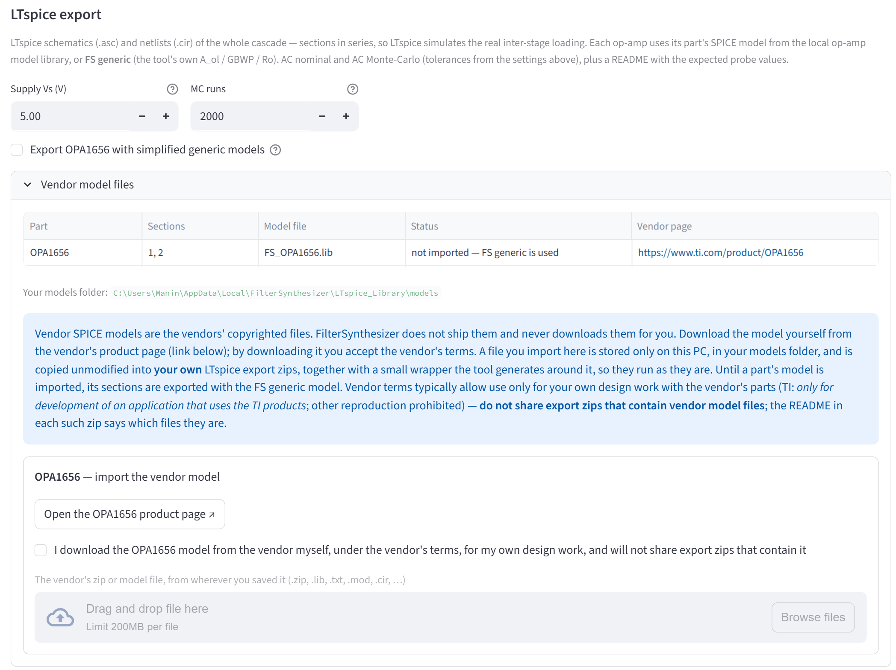

1. **Pick the part** in Tab 3 for at least one section and pick its BOM. The
   **Vendor model files** expander opens by itself while a model is missing.
2. **Open the product page** with the button (or the link in the status table)
   and download the part's PSpice model — usually a zip — to any folder.
3. **Tick the consent box**: *I download the … model from the vendor myself,
   under the vendor's terms, for my own design work, and will not share export
   zips that contain it.* The file picker is greyed until you do.
4. **Choose the file** — the vendor's zip as downloaded, or the model file
   itself (.lib, .txt, .mod, .cir …).
5. **Check the subcircuit and its pins.** The app finds the model's
   subcircuit and reads each pin's role (in+, in−, V+, V−, out) from the pin
   names or the vendor's pinout note. When it cannot, it says so — set each pin
   from the comment above the model's `.subckt` line.
6. **Import the … model.** The status turns to *imported … — bundled into the
   zip*, and the part's sections switch to the vendor model.

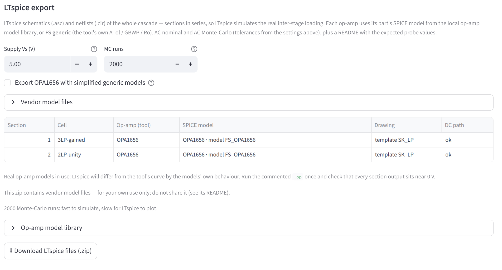

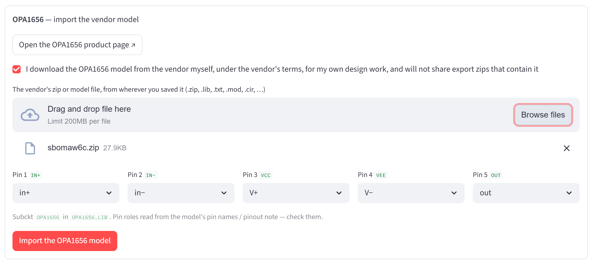

| Control | Key | What it does |
|---|---|---|
| Consent | `spice_vendor_consent_*` | Per part. Required before a file can be chosen. |
| The vendor's zip or model file | `spice_vendor_up_*` | The file to import, from wherever you saved it. A model already in your models folder is offered without a new download. |
| Model subcircuit | `spice_vendor_sub_*` | Shown when the file holds more than one subcircuit. |
| Pin *k* | `spice_vendor_role_*_*_*` | The role of each of the subcircuit's five pins; each role exactly once. |
| Import the … model | `spice_vendor_inst_*` | Imports it. An error names what is wrong (a role used twice, an unreadable file). |
| Re-import the … model (a new revision) | `spice_vendor_redo_*` | For a part already imported: shows the import again, for a newer model. |
| I accept the vendor's terms for …: bundle them into my own zips | `spice_vendor_allow` | Only for model files placed in the models folder by hand, without consent recorded: records it, so they are bundled. |

**What is stored.** The vendor's file, unchanged except for a few top-level
directive lines that would break inside a cascade, as `<PART>__<file>`, and a
small wrapper the app generates around it, `FS_<PART>.lib`, which maps the
vendor's pins onto the app's op-amp symbol and keeps the vendor's helper
subcircuits from colliding with another vendor's. Both go to your models
folder — `%LOCALAPPDATA%\FilterSynthesizer\LTspice_Library\models` — together
with a record of the consent. The status table shows that folder.

> [!warning] An export zip that contains vendor model files is for your own
> use. Vendor terms typically allow the model only for your own design work
> with the vendor's parts (TI: *only for development of an application that
> uses the TI products*). Do not share such a zip: the caption under the table
> says when a zip contains them, and its README names the files. To share a
> design, tick **Export … with simplified generic models** first.

## 9.4 What is in the zip, and how to run it

| File | Contents |
|---|---|
| `<design>_AC.asc` | Schematic with nominal values: AC sweep over the tool's frequency grid, `.meas` probes, only V(OUT) saved so LTspice plots it at once. |
| `<design>_AC_MC.asc` | The same with Monte-Carlo values: the tolerances, distribution and run count from Tab 4. |
| `<design>_AC.cir`, `<design>_AC_MC.cir` | The same two circuits as netlists; they open without any symbol or library. |
| `README.txt` | The design, the files, how to run, the circuit conventions, each section's cell, model and drawing, the Monte-Carlo settings, the expected probe values, warnings. |
| `FS_<PART>.lib`, `<PART>__<file>` | Only when a vendor model is used: the wrapper and the vendor's file. Keep them next to the .asc / .cir. |

`<design>` is the specification in short, e.g. `Butterworth_Lowpass_n5`.
Nominal and Monte-Carlo are separate files on purpose: LTspice's random
functions never return the nominal value, and the nominal file keeps plain
values you can read and edit. The schematics and netlists come from one model
of the circuit and are checked against each other; if a schematic fails that
check it is left out of the zip, with a warning, and the netlists remain.

**Running it:**

1. Extract the whole zip into one folder.
2. In LTspice 24, **File › Open** the .asc — or a .cir, with the file type set
   to *Netlists (*.cir)*.
3. **Simulate › Run.** V(OUT) is plotted in magnitude and phase;
   right-click the phase axis and choose *Group Delay* for τ(f). Delete the
   `.save V(OUT)` line to probe internal nodes.
4. **View › SPICE Error Log** lists the `.meas` probes — one value per run in
   the Monte-Carlo file; right-click the log and choose *Plot .step'ed .meas
   data* to see their spread.

**Checking the result.** The README's *EXPECTED VALUES* gives, per probe
frequency, the *loaded* value — the cascade exactly as written, which LTspice
must match to about 0.01 dB with generic models — and the *tool* value, the
app's realized curve. With real models, run the commented `.op` once first and
check that every section output sits near 0 V; the expected values are then a
passband sanity reference only.

**Conventions in the circuit:** input IN, output OUT, section *k*'s output
S*k*; designators carry the section number — R201 is section 2's R1, a split
capacitor is C202A / C202B, op-amp U201. The LTspice Monte-Carlo differs from
the tool's in two small ways: LTspice draws its own random numbers, so only the
statistics compare, and a split capacitor is two parts drawn independently
(the tool varies their sum), which makes the tool's band slightly wider.
